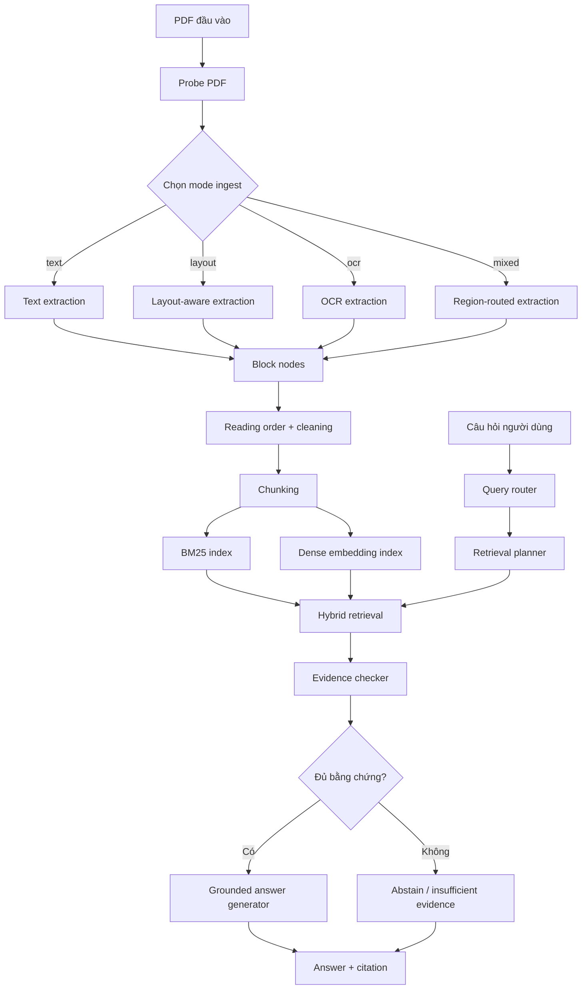
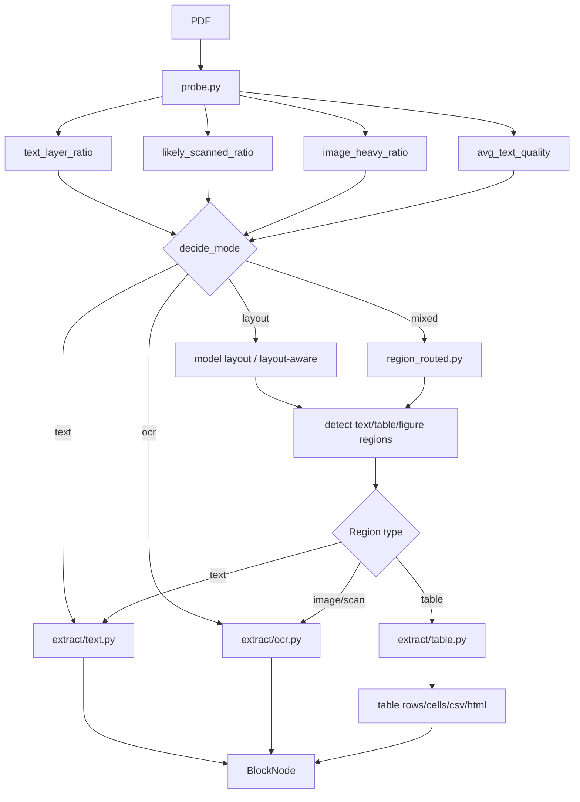
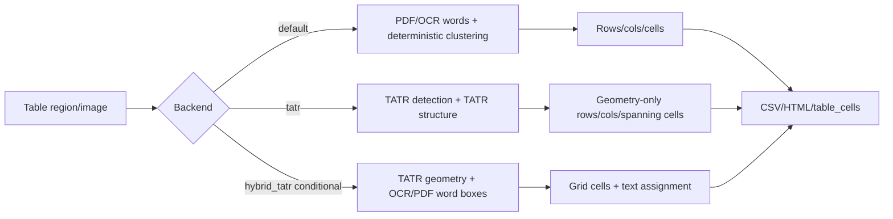

# Architecture, Models and End-to-End Benchmark Report 2026-05-14

## 1. Mục đích tài liệu

Tài liệu này tổng hợp lại toàn bộ kiến trúc hệ thống BOXTALK, các mô hình/kỹ thuật đã sử dụng và kết quả benchmark từ đầu đến cuối. Nội dung được viết theo hướng có thể dùng cho:

- chương mô tả hệ thống trong đồ án;
- chương thực nghiệm;
- slide bảo vệ;
- phần giải thích demo.

Phạm vi đúng của hệ thống:

- Pipeline chính: `PDF ingest -> conditional hybrid_tatr table enhancement -> chunk/index -> retrieval -> routed_grounded -> grounded answer + citation`.
- Backend QA chính: `routed_grounded`.
- Ingest chính: `default ingest backend` có thêm bước tự động thử `hybrid_tatr` cho block/vùng bảng khi đủ điều kiện.
- Không bật LLM thật làm lõi pipeline chính.
- `hybrid_tatr` là module tăng cường bảng có điều kiện trong pipeline chính; module này chỉ chạy cho table block và luôn fallback về backend mặc định nếu thiếu điều kiện.

## 2. Sơ đồ kiến trúc tổng thể



Ý nghĩa chính:

- `Probe PDF` quyết định tài liệu thiên về text, layout, scan hay mixed.
- `Block nodes` là đơn vị trung gian sau ingest, có text, bbox, page, block type và metadata.
- `Chunking` chuyển block thành đơn vị lập chỉ mục.
- Retrieval dùng kết hợp sparse BM25 và dense embeddings.
- `routed_grounded` trả lời dựa trên bằng chứng đã truy xuất và gắn citation.

## 3. Sơ đồ ingest chi tiết



Luồng chính hiện tại dùng default ingest và có thêm bước `hybrid_tatr` có điều kiện cho block/vùng `table`.

## 4. Sơ đồ xử lý bảng



Diễn giải:

- `default`: ổn định hơn cho pipeline chính, có text assignment tốt.
- `TATR`: tốt về phát hiện bảng và row/column geometry, nhưng image-only nên không tự có text trong cell.
- `hybrid_tatr`: dùng TATR để lấy geometry và dùng OCR/PDF word boxes để gán text vào cell. Module này hiện được nối vào pipeline chính theo cơ chế có điều kiện/fallback cho bảng.

## 5. Các mô hình và kỹ thuật sử dụng

| Tầng | Thành phần | Mô hình/kỹ thuật | Vai trò | Trạng thái |
|---|---|---|---|---|
| PDF probe | `app/ingest/probe.py` | Heuristic text/image/quality ratios | Chọn mode ingest | Chính |
| Text extraction | PyMuPDF/fitz text blocks | Rule + PDF text layer | Trích xuất text có sẵn trong PDF | Chính |
| Layout detection | DocLayNet/PubLayNet-compatible layout backend | Object detection/layout labels | Phát hiện text, title, table, figure, caption | Chính/benchmark |
| OCR | PaddleOCR GPU | OCR text boxes | Đọc scan/image-heavy PDF | Chính cho OCR path |
| Reading order | `reading_order.py` | Heuristic multi-column sorting | Sắp xếp block theo thứ tự đọc | Chính |
| Table default | `extract/table.py` | OCR/PDF word clustering | Tạo rows/cols/cells/csv/html | Chính/fallback |
| Table TATR | Microsoft Table Transformer | `microsoft/table-transformer-detection`, `microsoft/table-transformer-structure-recognition-v1.1-all` | Geometry bảng/hàng/cột | Thành phần của hybrid |
| Table hybrid | TATR + OCR/PDF word boxes | Deterministic text assignment | Cải thiện structure/text-in-cell cho table block | Chính có điều kiện |
| Sparse retrieval | BM25 | Lexical retrieval | Tìm đoạn theo từ khóa | Chính |
| Dense retrieval | MiniLM | `sentence-transformers/all-MiniLM-L6-v2` | Semantic retrieval | Chính |
| Rerank | heuristic reranker | Score fusion/heuristic rerank | Sắp xếp lại kết quả | Chính/benchmark |
| Query routing | `QueryRouter` | Rule/heuristic query type | Chọn chiến lược retrieval | Chính |
| Retrieval planner | `QueryAwareRetrievalPlanner` | Rule theo query type | Chọn top-k, candidate-k, weights, rerank | Chính |
| Evidence check | `EvidenceChecker` | Heuristic relevance/coverage/grounding | Quyết định đủ bằng chứng hay không | Chính |
| Answer generation | `GroundedAnswerGenerator` | Extractive/rule-based answer | Trả lời ngắn có citation | Chính |
| LLM fallback | OpenAI-compatible/Ollama/dummy | Optional grounded fallback | Thử nghiệm explanation/synthesis | Không bật chính |

## 6. Luồng end-to-end từ PDF đến câu trả lời

### 6.1. Bước 1: PDF ingest

Input là file PDF. Hệ thống probe các đặc trưng:

- số trang có text layer;
- số trang không có text;
- tỉ lệ trang scan;
- tỉ lệ trang nhiều ảnh;
- chất lượng text trích xuất;
- số block, số ảnh, số ký tự trung bình.

Từ đó hệ thống chọn hướng xử lý:

- `text`: tài liệu có text layer tốt;
- `layout`: tài liệu có bố cục phức tạp nhưng text layer tốt;
- `ocr`: tài liệu scan hoặc không có text layer;
- `mixed`: tài liệu lai, có vùng text và vùng scan/bảng/ảnh.

### 6.2. Bước 2: Extract block/region

Hệ thống trích xuất thành `BlockNode` gồm:

- `text`;
- `page_index`, `page_label`;
- `bbox`;
- `block_type`: paragraph, heading, table, figure, caption, list_item;
- metadata phục vụ citation và retrieval.

Với bảng, hệ thống cố gắng sinh thêm:

- `table_rows`;
- `table_cells`;
- `table_records`;
- `table_csv`;
- `table_html`.

### 6.3. Bước 3: Reading order và chunking

Các block được sort theo thứ tự đọc. Với PDF nhiều cột, sorter cố gắng nhận diện cột và đọc theo cột thay vì chỉ sort `(y, x)`.

Sau đó hệ thống chunk nội dung để lập chỉ mục. Chunk giữ metadata như page, section, heading path, block type và source name.

### 6.4. Bước 4: Indexing

Mỗi chunk được đưa vào:

- BM25 index cho truy xuất từ khóa;
- dense embedding index MiniLM cho truy xuất ngữ nghĩa.

### 6.5. Bước 5: Query routing và retrieval

Câu hỏi được router phân loại, ví dụ:

- factoid;
- definition;
- policy;
- procedural;
- comparison;
- table lookup;
- multi-hop.

Planner chọn retrieval config phù hợp:

- top-k;
- candidate-k;
- BM25/dense weights;
- rerank;
- context window;
- metadata filter nếu cần.

### 6.6. Bước 6: Evidence checking

Evidence checker đánh giá:

- relevance;
- coverage;
- consistency;
- citation support;
- grounding;
- sufficiency.

Nếu bằng chứng không đủ, hệ thống có thể abstain hoặc trả lời không đủ thông tin.

### 6.7. Bước 7: Grounded answer + citation

Answer generator sinh câu trả lời ngắn dựa trên các evidence đã chọn. Citation gắn với chunk/page/section tương ứng. Đây là cơ chế chính giúp giảm hallucination.

## 7. Benchmark từ đầu đến cuối

### 7.1. Validation cuối

| Check | Kết quả |
|---|---:|
| `python -m compileall app scripts` | pass |
| `python -m pytest -q` | 55 passed |
| ingest mock final check | success_rate = 1.000 |

### 7.2. Ingest benchmark before/after

| Benchmark | Metric | Before | After | Diễn giải |
|---|---|---:|---:|---|
| Bast-Korzen proxy | token F1 | - | 0.998 | Text extraction tốt trên proxy |
| DocLayNet 25 | layout F1@0.50 | 0.815 | 0.879 | Layout detection cải thiện |
| PubLayNet 25 | layout F1@0.50 | 0.771 | 0.778 | Scientific layout tăng nhẹ |
| PubTables detection 25 | table det F1@0.50 | - | 0.987 | Table bbox detection mạnh |
| PubTables structure OCR words 25 | structure F1 | 0.638 | 0.638 | Giữ ổn định sau QA cleanup |
| OCR scan 25 | OCR token F1 | - | 1.000 | OCR path pass subset |
| Nougat/arXiv proxy 25 | token F1 | - | 0.628 | Academic proxy còn khó |

### 7.3. Table structure before/after theo từng pass

| Mốc | Det F1@0.50 | Cell F1@0.50 | Structure F1 | Text assign F1 | Ghi chú |
|---|---:|---:|---:|---:|---|
| OCR table structure ban đầu | 0.900 | 0.435 | 0.208 | - | Baseline OCR cluster nhỏ |
| Structure post-processing | 0.967 | 0.668 | 0.169 | 0.963 | Cell bbox/text assignment tốt hơn |
| Row/column fix | 0.967 | 0.659 | 0.202 | 0.963 | Row MAE giảm 2.240 -> 2.040 |
| hybrid_tatr OCR words | 0.987 | 0.598 | 0.638 | 0.955 | Structure tăng mạnh nhờ TATR geometry + OCR words |

Lưu ý: Cell F1 của `hybrid_tatr OCR words` thấp hơn một số mốc default ở IoU@0.50, nhưng structure F1 và GriTS-con-like cao hơn rõ rệt. Điều này cho thấy geometry/text assignment giúp tái tạo cấu trúc logic tốt hơn, dù bbox cell chưa luôn khớp tuyệt đối.

### 7.4. So sánh backend bảng

| Backend | Det F1@0.50 | Cell F1@0.50 | Cell F1@0.75 | Structure F1 | Text assign F1 | Row MAE | Col MAE | GriTS-con-like | Exact CSV |
|---|---:|---:|---:|---:|---:|---:|---:|---:|---:|
| Default | 0.967 | 0.659 | 0.184 | 0.202 | 0.963 | 2.040 | 0.840 | 0.147 | 0.000 |
| TATR | 0.987 | 0.491 | 0.103 | 0.010 | 0.015 | 0.600 | 0.000 | 0.006 | 0.000 |
| hybrid_tatr OCR words | 0.987 | 0.598 | 0.248 | 0.638 | 0.955 | 0.600 | 0.000 | 0.387 | 0.040 |

Kết luận:

- Default vẫn là fallback ổn định vì có text assignment tốt và không phụ thuộc model nặng.
- TATR geometry-only không đủ cho table QA vì thiếu text.
- `hybrid_tatr OCR words` là module table structure tốt nhất và đã được nối vào pipeline chính theo cơ chế có điều kiện; nó không thay toàn bộ ingest backend vì còn phụ thuộc OCR/PDF word boxes và merged-cell handling.

### 7.5. QA E2E before/after

| Benchmark | Before answer match | After answer match | Delta | Before E2E | After E2E | Before hallucination | After hallucination |
|---|---:|---:|---:|---:|---:|---:|---:|
| QA smoke routed | 1.000 | 1.000 | +0.000 | 1.000 | 1.000 | 0.000 | 0.000 |
| QCDT routed same index | 0.725 | 0.725 | +0.000 | 0.725 | 0.725 | 0.000 | 0.000 |
| QCDT routed older baseline index | 0.675 | 0.725 | +0.050 | 0.675 | 0.725 | 0.000 | 0.000 |
| Attention comparable old text index | 1.000 | 1.000 | +0.000 | 1.000 | 1.000 | 0.000 | 0.000 |
| Attention rebuilt region_routed no reranker | 1.000 | 0.870 | -0.130 | 1.000 | 0.870 | 0.000 | 0.000 |
| Operations routed | 0.925 | 0.925 | +0.000 | 0.925 | 0.925 | 0.025 | 0.000 |

Diễn giải:

- QA chính không regression trên các run so sánh trực tiếp.
- Operations giảm hallucination từ 0.025 xuống 0.000.
- Attention rebuilt giảm do khác index/config, không phải do QA generator đơn thuần.

### 7.6. QA table answer before/after

| Run | Câu trả lời |
|---|---|
| Before table-answer tightening | `VPN access is owned by IT Support Benefits.` |
| After table-answer tightening | `VPN access is owned by IT Support.` |

Kết quả này cho thấy bước answer formatting/table answer cleanup giúp câu trả lời ngắn và ít dính text dư từ cell lân cận hơn.

### 7.7. SciFact benchmark

SciFact là benchmark claim-evidence/citation khoa học công khai.

| Metric | Kết quả |
|---|---:|
| query_count | 300 |
| answer_match_rate | 0.220 |
| evidence_match_rate | 0.727 |
| grounded_rate | 1.000 |
| hallucination_rate | 0.000 |
| end_to_end_success_rate | 0.203 |
| hybrid hit@5 | 0.793 |
| hybrid recall@5 | 0.771 |
| hybrid MRR@5 | 0.654 |
| hybrid NDCG@5 | 0.675 |

Diễn giải:

- SciFact phù hợp để đánh giá evidence/citation.
- Answer match thấp vì SciFact không phải natural QA benchmark gốc.
- Điểm quan trọng nhất: evidence_match 0.727 và hallucination 0.000.

### 7.8. QASPER benchmark

QASPER là benchmark natural scientific QA khó hơn SciFact.

Subset:

| Field | Value |
|---|---:|
| papers | 82 |
| chunks | 3,630 |
| questions | 100 |
| answerable | 95 |
| unanswerable | 5 |
| evidence mapped to chunks | 90 |

QA:

| Metric | Kết quả |
|---|---:|
| answer_match_rate | 0.100 |
| evidence_match_rate | 0.360 |
| grounded_rate | 1.000 |
| hallucination_rate | 0.050 |
| end_to_end_success_rate | 0.020 |
| abstain_accuracy | 0.000 |

Retrieval-only:

| Run | Hybrid rerank Hit | Hybrid rerank Recall |
|---|---:|---:|
| top_k=5 | 0.400 | 0.336 |
| top_k=10 | 0.520 | 0.451 |
| top_k=20 | 0.580 | 0.530 |

QA probe:

| Config | Answer match | Evidence match | E2E |
|---|---:|---:|---:|
| routed_grounded default | 0.100 | 0.360 | 0.020 |
| hybrid_no_routing top_k=10 | 0.090 | 0.470 | 0.040 |
| hybrid_no_routing top_k=20 | 0.090 | 0.510 | 0.040 |

Kết luận:

- Tăng top-k/rerank cải thiện evidence recall.
- Answer correctness không tăng tương ứng.
- Nút thắt chính là answer synthesis/free-form QA và abstention, không chỉ retrieval.

## 8. Báo cáo chi tiết theo giai đoạn phát triển

### 8.1. Giai đoạn 1: Xây pipeline PDF QA cơ bản

Kết quả đạt được:

- đọc PDF;
- trích xuất text;
- chunk/index;
- BM25/dense retrieval;
- grounded QA có citation.

Rủi ro ban đầu:

- PDF scan không có text;
- bảng bị flatten thành text khó hiểu;
- citation không đủ chặt;
- answer dễ lẫn text dư.

### 8.2. Giai đoạn 2: Chuẩn hóa ingest và benchmark

Kết quả đạt được:

- thêm benchmark ingest suite;
- thêm adapter cho DocLayNet, PubLayNet, PubTables, OCR, mock;
- thêm metric text, layout, table, OCR;
- thêm README/docs reproduce.

Giá trị:

- đo được lỗi ingest thay vì chỉ nhìn QA cuối;
- biết rõ table detection tốt nhưng table structure còn yếu.

### 8.3. Giai đoạn 3: Cải thiện table structure

Kết quả đạt được:

- thêm rows/cols/cells/csv/html;
- thêm row/column clustering;
- thêm table debug metrics;
- thêm TATR và hybrid_tatr;
- thêm GriTS-like metrics.

Điểm mạnh:

- table detection rất tốt;
- hybrid_tatr cải thiện structure F1.

Điểm còn yếu:

- exact CSV/HTML thấp;
- OCR word boxes ảnh hưởng trực tiếp;
- merged cell/caption/footnote còn khó.

### 8.4. Giai đoạn 4: Cải thiện QA và citation

Kết quả đạt được:

- `routed_grounded` làm QA path chính;
- table answer cleanup;
- evidence/citation check;
- benchmark QA E2E;
- SciFact citation benchmark;
- QASPER natural QA benchmark.

Điểm mạnh:

- hallucination thấp trong benchmark chính;
- citation/evidence có thể đo được.

Điểm còn yếu:

- answer synthesis free-form chưa mạnh;
- unanswerable/abstention còn yếu trên QASPER.

## 9. Commands reproduce chính

### Validation

```powershell
.\.venv-gpu\Scripts\python.exe -m compileall app scripts
.\.venv-gpu\Scripts\python.exe -m pytest -q
.\.venv-gpu\Scripts\python.exe scripts\benchmark_ingest_suite.py --dataset mock --limit 5 --out results\ingest\mock_final_check --mode all
```

### QASPER

```powershell
.\.venv-gpu\Scripts\python.exe scripts\prepare_qasper_qa_benchmark.py --output-dir data\benchmarks\qasper_qa --split validation --limit 100 --seed 42
.\.venv-gpu\Scripts\python.exe scripts\build_retrieval_index.py --chunks-jsonl data\benchmarks\qasper_qa\qasper.jsonl --output-dir results\retrieval_index\qasper_qa_minilm_20260513 --dense-preset minilm --dense-device cuda
.\.venv-gpu\Scripts\python.exe scripts\benchmark_qa.py --index-dir results\retrieval_index\qasper_qa_minilm_20260513 --queries data\benchmarks\qasper_qa\queries.jsonl --output-dir results\qa_benchmark\qasper_qa_minilm_20260513 --config routed_grounded --no-warmup
```

### SciFact

```powershell
.\.venv-gpu\Scripts\python.exe scripts\prepare_scifact_qa_benchmark.py --beir-dir data\beir\scifact --output-dir data\benchmarks\scifact_qa --split test
.\.venv-gpu\Scripts\python.exe scripts\build_retrieval_index.py --chunks-jsonl data\benchmarks\scifact_qa\scifact.jsonl --output-dir results\retrieval_index\scifact_qa_minilm_20260513 --dense-preset minilm --dense-device cuda
.\.venv-gpu\Scripts\python.exe scripts\benchmark_qa.py --index-dir results\retrieval_index\scifact_qa_minilm_20260513 --queries data\benchmarks\scifact_qa\queries_test.jsonl --output-dir results\qa_benchmark\scifact_qa_minilm_heuristic_20260513 --config routed_grounded --no-warmup
```

### Hybrid TATR OCR words

```powershell
.\.venv-ocr-gpu\Scripts\python.exe scripts\prepare_pubtables_ocr_word_boxes.py --data-dir data\benchmarks\pubtables_structure --out data\benchmarks\pubtables_structure_ocr_words --limit 25 --lang en --device gpu:0 --min-confidence 0.5
.\.venv-gpu\Scripts\python.exe scripts\benchmark_ingest_suite.py --dataset pubtables_structure --data-dir data\benchmarks\pubtables_structure_ocr_words --limit 25 --out results\ingest\pubtables_structure_ocr_words_25_hybrid_tatr --mode table --table-backend hybrid_tatr --save-predictions
```

## 10. Safe claims cho báo cáo

Có thể nói:

- Hệ thống đã xây dựng pipeline PDF QA hoàn chỉnh có citation.
- Pipeline chính `routed_grounded` đạt grounded_rate cao trên benchmark chính.
- Không ghi nhận hallucination trong QA smoke, QCDT, Operations và SciFact với cấu hình chính.
- PubTables detection đạt F1@0.50 cao trên subset.
- `hybrid_tatr OCR words` cải thiện table structure F1 trên PubTables structure subset.
- SciFact cho thấy năng lực citation/evidence trên benchmark công khai.
- QASPER cho thấy giới hạn thật của natural scientific QA trên paper dài.

Không nên nói:

- Không claim SOTA.
- Không claim xử lý hoàn hảo mọi PDF.
- Không claim table extraction hoàn chỉnh.
- Không claim exact CSV/HTML đã giải quyết xong.
- Không claim `hybrid_tatr` thay thế toàn bộ production ingest backend; chỉ claim nó là module tăng cường bảng có điều kiện.
- Không claim LLM là lõi chính của hệ thống.

## 11. Kết luận chốt

BOXTALK đã đạt mục tiêu chính của đồ án: xây dựng một hệ thống hỏi đáp trên PDF có pipeline ingest, retrieval, grounded QA và citation; đồng thời có benchmark nhiều tầng để đánh giá chất lượng. Kết quả tốt nhất nằm ở khả năng trích xuất/truy xuất có căn cứ và kiểm soát hallucination trong các benchmark chính. `hybrid_tatr` hiện đã được nối vào pipeline chính như module tăng cường bảng có điều kiện/fallback. QASPER là phần quan trọng để chứng minh người làm đồ án hiểu giới hạn của hệ thống: natural scientific QA trên paper dài vẫn cần retrieval theo section, answer synthesis tốt hơn và abstention mạnh hơn.
