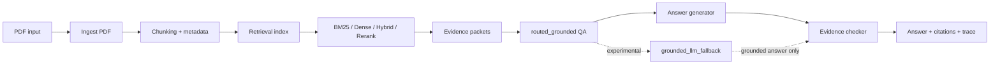

# Báo Cáo Đồ Án: Nghiên Cứu Các Kĩ Thuật Truy Xuất Và Hỏi Đáp Thông Tin Trên Tài Liệu PDF

Phiên bản: `draft-v0.1`

Ngày cập nhật: `2026-05-05`

## Tóm Tắt

Đồ án tập trung nghiên cứu và xây dựng một hệ thống hỏi đáp thông tin trên tài liệu PDF theo hướng `grounded QA`: câu trả lời phải được sinh ra dựa trên bằng chứng truy xuất được từ tài liệu, có trích dẫn nguồn và hạn chế tối đa hiện tượng bịa thông tin. Hệ thống được thiết kế theo kiến trúc nhiều bước gồm nạp tài liệu PDF, phân tích nội dung, chia đoạn, lập chỉ mục truy xuất, chọn chiến lược truy xuất phù hợp, sinh câu trả lời có căn cứ và kiểm tra độ bám bằng chứng.

Các kĩ thuật chính được khảo sát và tích hợp gồm truy xuất từ khóa `BM25`, truy xuất ngữ nghĩa bằng embedding, truy xuất lai `hybrid`, xếp hạng lại kết quả `rerank`, hỏi đáp có kiểm soát bằng bằng chứng, định tuyến câu hỏi theo loại nội dung và nhánh fallback sử dụng LLM theo chế độ thực nghiệm. Kết quả hiện tại cho thấy nhánh chính `routed_grounded` đạt hiệu quả tốt hơn baseline từ khóa trên bộ kiểm thử PDF nội bộ, giữ được groundedness ở mức `100%` và không ghi nhận hallucination trong benchmark chính.

Đồ án được định vị là một prototype nghiên cứu cho bài toán truy xuất và hỏi đáp trên PDF. Hệ thống chưa được claim là production-ready vì vẫn thiếu bộ PDF production có nhãn đầy đủ, table reasoning nâng cao còn hạn chế và fallback LLM vẫn đang được giữ ở phạm vi experimental.

## Chương 1. Mở Đầu

### 1.1. Lý Do Chọn Đề Tài

PDF là định dạng tài liệu phổ biến trong môi trường học thuật, hành chính và doanh nghiệp. Nhiều tài liệu quan trọng như quy chế, hướng dẫn nghiệp vụ, báo cáo khoa học, biểu mẫu và tài liệu đào tạo thường được lưu dưới dạng PDF. Tuy nhiên, việc tìm kiếm và hỏi đáp trực tiếp trên PDF vẫn gặp nhiều khó khăn do tài liệu có cấu trúc phức tạp, có thể chứa văn bản nhiều cột, bảng biểu, hình ảnh, công thức, tiêu đề, chú thích và các vùng thông tin không đồng nhất.

Các hệ thống hỏi đáp truyền thống thường dựa trên tìm kiếm từ khóa hoặc yêu cầu người dùng đọc thủ công tài liệu sau khi tìm thấy trang liên quan. Cách tiếp cận này chưa đủ thuận tiện khi người dùng cần câu trả lời ngắn gọn, chính xác và có dẫn chứng. Trong khi đó, các mô hình ngôn ngữ lớn có khả năng sinh câu trả lời tự nhiên nhưng dễ gặp vấn đề hallucination nếu không bị ràng buộc bởi bằng chứng từ tài liệu.

Vì vậy, đề tài lựa chọn hướng nghiên cứu kết hợp truy xuất thông tin và hỏi đáp có căn cứ trên PDF. Mục tiêu không chỉ là trả lời đúng, mà còn phải chỉ ra bằng chứng hỗ trợ câu trả lời, kiểm soát rủi ro sinh sai và đánh giá hệ thống bằng các benchmark có thể tái lập.

### 1.2. Mục Tiêu Đề Tài

Mục tiêu chính của đồ án là xây dựng và đánh giá một hệ thống hỏi đáp trên tài liệu PDF có khả năng:

- Nạp và xử lý nhiều loại PDF khác nhau, bao gồm tài liệu quy định, tài liệu hướng dẫn và bài báo khoa học.
- Truy xuất các đoạn bằng chứng liên quan bằng nhiều chiến lược như BM25, dense retrieval, hybrid retrieval và reranking.
- Sinh câu trả lời ngắn gọn, có căn cứ và gắn với citation.
- Kiểm soát hallucination bằng cách ưu tiên evidence-first và citation-first.
- So sánh hiệu quả giữa baseline từ khóa và pipeline hỏi đáp có định tuyến.
- Đánh giá nhánh LLM fallback ở phạm vi thực nghiệm mà không làm thay đổi main path.
- Xây dựng benchmark riêng cho các câu hỏi dạng bảng nhằm phân tích điểm mạnh và điểm yếu của table QA.

### 1.3. Phạm Vi Nghiên Cứu

Đồ án tập trung vào hệ thống hỏi đáp trên PDF ở mức prototype nghiên cứu. Phạm vi bao gồm ingest PDF, truy xuất thông tin, sinh câu trả lời grounded, benchmark QA và phân tích thực nghiệm. Hệ thống không đặt mục tiêu trở thành sản phẩm production hoàn chỉnh trong phạm vi đồ án.

Các nội dung chưa nằm trong phạm vi chính gồm triển khai GraphRAG quy mô lớn, huấn luyện lại mô hình nền, xử lý thị giác tài liệu chuyên sâu ở mức end-to-end, hoặc biến LLM fallback thành đường trả lời mặc định.

### 1.4. Đóng Góp Chính

Các đóng góp chính của đồ án gồm:

- Xây dựng pipeline hỏi đáp PDF theo hướng grounded QA với citation và evidence checking.
- Tích hợp nhiều chiến lược truy xuất gồm BM25, dense, hybrid và rerank.
- Thiết kế `routed_grounded` làm main QA path để chọn cách xử lý phù hợp theo loại câu hỏi và bằng chứng.
- Xây dựng bộ benchmark nội bộ trên nhiều loại PDF và cơ chế regression gate để tránh suy giảm chất lượng.
- Bổ sung benchmark table reasoning mở rộng lấy cảm hứng từ WikiTableQuestions, TAT-QA và TabFact nhưng được nội địa hóa cho hệ PDF grounded QA.
- Đánh giá nhánh `grounded_llm_fallback` với provider thật ở phạm vi experimental, tách biệt với gate chính.

## Chương 2. Cơ Sở Lý Thuyết

### 2.1. Đặc Thù Của Tài Liệu PDF

PDF không chỉ là văn bản thuần. Một file PDF có thể chứa nhiều lớp thông tin như văn bản nhúng, ảnh scan, bảng, hình minh họa, chú thích, footer, header và bố cục nhiều cột. Vì vậy, xử lý PDF cần quan tâm cả nội dung chữ và cấu trúc hiển thị.

Các thách thức chính gồm:

- Thứ tự đọc có thể khác thứ tự lưu trong file.
- Bảng biểu có thể bị mất cấu trúc hàng/cột khi trích xuất thành text.
- Một số tài liệu là ảnh scan và cần OCR.
- Nội dung liên quan đến một câu hỏi có thể nằm rải rác ở nhiều đoạn hoặc nhiều trang.
- Trích dẫn nguồn cần giữ được thông tin trang, chunk và vùng bằng chứng.

### 2.2. Truy Xuất Thông Tin

Truy xuất thông tin là bước tìm các đoạn tài liệu có khả năng chứa câu trả lời. Trong đồ án, các hướng truy xuất chính gồm:

- `BM25`: phương pháp truy xuất từ khóa dựa trên tần suất từ và độ hiếm của từ trong tập tài liệu. BM25 nhanh, ổn định và đặc biệt mạnh với câu hỏi có từ khóa trùng trực tiếp với tài liệu.
- `Dense retrieval`: biểu diễn câu hỏi và đoạn văn bằng vector embedding, sau đó tìm các đoạn gần nhất trong không gian vector. Cách này tốt hơn khi câu hỏi và tài liệu dùng cách diễn đạt khác nhau.
- `Hybrid retrieval`: kết hợp điểm từ BM25 và dense retrieval để tận dụng cả lexical matching và semantic matching.
- `Reranking`: xếp hạng lại các ứng viên đã truy xuất nhằm đưa bằng chứng liên quan nhất lên đầu.

Kết quả thực nghiệm cho thấy BM25 vẫn là baseline mạnh và rất nhanh, trong khi dense retrieval có thể cải thiện chất lượng xếp hạng trên một số bộ kiểm thử nhỏ. Hybrid retrieval phù hợp cho hệ thống thực tế vì cân bằng giữa khớp từ khóa và khớp ngữ nghĩa.

### 2.3. Hỏi Đáp Có Căn Cứ Trên Bằng Chứng

Hỏi đáp có căn cứ khác với sinh văn bản tự do ở chỗ câu trả lời phải dựa trên bằng chứng đã truy xuất. Trong hệ thống này, câu trả lời chỉ nên được sinh ra nếu có đủ bằng chứng. Nếu bằng chứng không đủ, hệ thống cần từ chối hoặc trả lời theo hướng không xác định.

Các nguyên tắc chính:

- `Evidence-first`: truy xuất và chọn bằng chứng trước khi trả lời.
- `Citation-first`: câu trả lời cần liên kết với chunk hoặc trang nguồn.
- `Groundedness`: nội dung câu trả lời phải được hỗ trợ bởi bằng chứng.
- `Abstention`: nếu tài liệu không cung cấp đủ thông tin, hệ thống không nên suy đoán.

### 2.4. RAG Và Rủi Ro Hallucination

Retrieval-Augmented Generation kết hợp truy xuất tài liệu với mô hình sinh ngôn ngữ. Cách tiếp cận này giúp mô hình có thêm ngữ cảnh từ tài liệu cụ thể, nhưng vẫn có rủi ro hallucination nếu mô hình sinh thông tin không nằm trong bằng chứng.

Để giảm rủi ro, đồ án sử dụng pipeline grounded QA, kiểm tra sufficiency của evidence và theo dõi metric hallucination trong benchmark. Nhánh LLM fallback được giữ ở phạm vi experimental và chỉ được tính là có ích khi câu trả lời vẫn grounded.

### 2.5. Table QA

Table QA là một nhánh khó hơn text QA vì câu trả lời thường phụ thuộc vào cấu trúc hàng/cột, khoảng giá trị, điều kiện biên và đôi khi cần suy luận số học. Ví dụ, câu hỏi có thể yêu cầu ánh xạ điểm số sang điểm chữ, truy vấn ngược từ điểm chữ về khoảng điểm, kiểm tra một phát biểu đúng/sai theo bảng hoặc kết hợp bảng với đoạn văn mô tả điều kiện áp dụng.

Trong đồ án, table QA được đánh giá riêng bằng benchmark mở rộng gồm các nhóm: simple lookup, reverse lookup, interval mapping, multi-column lookup, boundary cases, table + text reasoning, numerical reasoning và fact verification.

### 2.6. Các Hướng Nghiên Cứu Liên Quan

Bài toán hỏi đáp trên PDF nằm ở giao điểm của nhiều hướng nghiên cứu: truy xuất thông tin, đọc hiểu tài liệu, xử lý bố cục tài liệu, RAG, table QA và đánh giá độ tin cậy của câu trả lời. Trong phạm vi đồ án, các hướng liên quan được chọn theo tiêu chí phục vụ trực tiếp cho hệ thống prototype thay vì khảo sát quá rộng.

Nhóm thứ nhất là các phương pháp truy xuất lexical. BM25 là một baseline kinh điển trong truy xuất thông tin vì đơn giản, nhanh và khó bị đánh bại trên các truy vấn có từ khóa rõ. Với tài liệu PDF tiếng Việt dạng quy chế, quy định hoặc hướng dẫn, lexical matching vẫn rất quan trọng vì nhiều câu hỏi chứa trực tiếp cụm từ xuất hiện trong tài liệu.

Nhóm thứ hai là truy xuất ngữ nghĩa bằng embedding. Các hướng như DPR hoặc các mô hình sentence embedding biểu diễn câu hỏi và đoạn văn trong cùng không gian vector. Ưu điểm là bắt được tương đồng về nghĩa ngay cả khi câu hỏi không dùng đúng từ khóa trong tài liệu. Nhược điểm là chi phí tính toán cao hơn BM25 và có thể kém ổn định nếu domain hoặc ngôn ngữ khác với dữ liệu huấn luyện.

Nhóm thứ ba là hybrid retrieval và reranking. Hybrid retrieval kết hợp lexical và dense score để giảm rủi ro của từng phương pháp riêng lẻ. Reranking dùng một mô hình mạnh hơn để xếp hạng lại danh sách ứng viên. Trong hệ thống PDF QA, cách tiếp cận này hợp lý vì bước truy xuất đầu cần nhanh, còn bước rerank chỉ áp dụng trên số lượng candidate nhỏ.

Nhóm thứ tư là Retrieval-Augmented Generation. RAG bổ sung ngữ cảnh truy xuất vào mô hình sinh để trả lời theo tài liệu cụ thể. Tuy nhiên, trong bối cảnh đồ án, RAG không được dùng theo nghĩa chatbot sinh tự do. Hệ thống được thiết kế theo hướng grounded QA: chỉ trả lời dựa trên evidence, có citation và có kiểm tra groundedness.

Nhóm thứ năm là table QA và fact verification trên bảng. Các benchmark như WikiTableQuestions, TAT-QA và TabFact cho thấy câu hỏi trên bảng không chỉ là lookup đơn giản mà còn có truy vấn ngược, ánh xạ khoảng, kiểm tra phát biểu và suy luận số học. Đồ án không đưa nguyên các benchmark này vào repo, mà xây dựng benchmark nội bộ nhỏ hơn, phù hợp hơn với pipeline PDF grounded QA hiện tại.

### 2.7. Khoảng Trống Mà Đồ Án Tập Trung

Các hệ thống hỏi đáp tài liệu thường gặp ba vấn đề khi áp dụng vào PDF thực tế. Thứ nhất, truy xuất đúng đoạn chưa đủ nếu hệ thống không giữ được citation và không kiểm tra câu trả lời có bám bằng chứng hay không. Thứ hai, một chiến lược truy xuất duy nhất khó tối ưu cho mọi loại tài liệu, nhất là khi tài liệu có cả quy định hành chính, handbook và bài báo khoa học. Thứ ba, bảng trong PDF thường bị mất cấu trúc khi chuyển thành text, làm cho table QA khó hơn nhiều so với QA trên đoạn văn.

Vì vậy, đồ án tập trung vào một hướng thực dụng: xây dựng pipeline có nhiều chiến lược truy xuất, giữ BM25 làm baseline mạnh, dùng `routed_grounded` làm main path, bổ sung benchmark để đo groundedness/hallucination, và cô lập LLM fallback ở nhánh experimental. Cách tiếp cận này giúp hệ thống có thể chứng minh được hiệu quả bằng số liệu mà vẫn giữ an toàn cho câu trả lời.

## Chương 3. Thiết Kế Hệ Thống

### 3.1. Kiến Trúc Tổng Quan

Pipeline của hệ thống gồm các bước chính:

1. Người dùng tải lên hoặc chọn tài liệu PDF.
2. Hệ thống ingest tài liệu, trích xuất text, layout, bảng và metadata.
3. Nội dung được chia thành các chunk có thông tin trang và định danh bằng chứng.
4. Hệ thống xây dựng chỉ mục truy xuất lexical và semantic.
5. Khi người dùng đặt câu hỏi, hệ thống truy xuất top-k evidence.
6. `routed_grounded` chọn cách xử lý phù hợp dựa trên loại câu hỏi và bằng chứng.
7. Answer generator tạo câu trả lời ngắn gọn kèm citation.
8. Evidence checker đánh giá câu trả lời có bám bằng chứng hay không.
9. Kết quả trả về UI gồm answer, citations và trace phục vụ debug.

Sơ đồ pipeline end-to-end:



Trong sơ đồ này, nhánh nét đứt là nhánh thực nghiệm. Nhánh này không thay thế `routed_grounded` và không nằm trong hard regression gates chính.

### 3.2. Main QA Path: `routed_grounded`

`routed_grounded` là đường xử lý chính của hệ thống. Đường này được thiết kế để giữ câu trả lời bám sát tài liệu, ưu tiên bằng chứng và hạn chế suy đoán. Đây là path được dùng để đánh giá chính và đi qua hard regression gates.

Vai trò của `routed_grounded`:

- Phân loại hoặc định tuyến câu hỏi theo dạng nội dung.
- Tận dụng evidence đã truy xuất để chọn câu trả lời.
- Áp dụng các rule và heuristic an toàn cho câu hỏi dạng bảng hoặc factoid.
- Kiểm tra groundedness trước khi chấp nhận câu trả lời.

### 3.3. Baseline: `bm25_only`

`bm25_only` được giữ làm strong lexical baseline. Baseline này có ý nghĩa quan trọng vì nhiều câu hỏi trên tài liệu hành chính hoặc quy định có từ khóa trùng trực tiếp với nội dung PDF. BM25 cũng có độ trễ rất thấp, dễ giải thích và ổn định.

Việc so sánh với BM25 giúp đánh giá liệu pipeline phức tạp hơn có thực sự tạo thêm giá trị hay không.

### 3.4. Experimental LLM Fallback

`grounded_llm_fallback` là nhánh thực nghiệm. Nhánh này chỉ được kích hoạt khi câu trả lời chuẩn yếu hoặc evidence cần reasoning phức tạp hơn. Fallback không được đưa vào main release flow và không thay đổi hard gates chính.

Fallback được kiểm soát bằng các nguyên tắc:

- Chỉ dùng khi evidence có sẵn.
- Không hardcode secret hoặc provider.
- Có benchmark riêng với real provider.
- Có gate phụ experimental, tách khỏi gate chính.
- Không chấp nhận câu trả lời nếu không grounded.

### 3.5. Phân Biệt `routed_grounded`, `grounded_llm_fallback` Và `llm_explanation`

Trong hệ thống có ba lớp dễ bị nhầm lẫn nhưng vai trò khác nhau:

| Thành phần | Vai trò | Có quyết định đáp án cuối không? | Phạm vi sử dụng |
|---|---|---:|---|
| `routed_grounded` | Đường QA chính: truy xuất evidence, sinh answer, kiểm tra groundedness và trả citation | Có | Main path, dùng trong benchmark/gate chính |
| `grounded_llm_fallback` | Nhánh fallback experimental: chỉ thử thay answer khi answer chuẩn yếu và LLM tạo được answer grounded hơn | Có, nhưng chỉ khi policy cho phép | Experimental-only, có gate phụ riêng |
| `llm_explanation` | Lớp diễn giải cuối: giải thích answer đã chốt bằng ngôn ngữ dễ hiểu hơn | Không | Tùy chọn cho UI/demo, không ảnh hưởng metric chính |

Thiết kế này giúp tách rõ hai mục tiêu. Mục tiêu thứ nhất là trả lời đúng và có căn cứ, do `routed_grounded` đảm nhiệm. Mục tiêu thứ hai là giúp người dùng hiểu đáp án dễ hơn, do `llm_explanation` đảm nhiệm. LLM explanation không được phép thêm tri thức bên ngoài, không được thay đổi đáp án, không thay đổi citation và không làm thay đổi groundedness. Nếu Ollama hoặc provider LLM lỗi, hệ thống vẫn trả về answer chuẩn.

### 3.6. UI Và Developer Trace

Hệ thống có MVP UI chạy qua FastAPI, hỗ trợ upload PDF, xem thư viện tài liệu, đặt câu hỏi, xem nguồn trích dẫn và bật developer trace. UI phục vụ demo và kiểm chứng pipeline, không phải trọng tâm nghiên cứu chính.

Ngoài câu trả lời chính, UI có thể hiển thị thêm `LLM explanation` nếu biến môi trường tương ứng được bật. Lớp này dùng LLM local như Ollama để diễn giải câu trả lời cuối cùng bằng ngôn ngữ dễ hiểu hơn cho người dùng. Explanation không được phép thay đổi answer, decision hoặc groundedness; nếu provider lỗi thì hệ thống vẫn trả về câu trả lời grounded như bình thường.

### 3.7. Thiết Kế Evidence Và Citation

Một yêu cầu quan trọng của hệ thống là mọi câu trả lời cần gắn với bằng chứng cụ thể. Vì vậy, mỗi chunk sau ingest cần giữ các thông tin tối thiểu gồm định danh tài liệu, trang, nội dung text, metadata về loại nội dung và vị trí tương đối trong tài liệu. Với câu hỏi dạng bảng, evidence nên giữ thêm dấu vết hàng/cột hoặc biểu diễn bảng đã chuẩn hóa nếu có.

Trong quá trình QA, hệ thống không chỉ trả về chuỗi answer mà còn trả về danh sách evidence được sử dụng. Điều này phục vụ ba mục tiêu. Thứ nhất, người dùng có thể kiểm tra nguồn. Thứ hai, benchmark có thể đo `evidence_match_rate` thay vì chỉ đo câu trả lời. Thứ ba, developer trace giúp phân tích lỗi khi hệ thống trả lời sai, ví dụ do truy xuất sai chunk, chọn sai route, hay answer generator không đọc đúng evidence.

### 3.8. Thiết Kế Benchmark Và Regression Gate

Đồ án không chỉ xây dựng pipeline mà còn xây dựng cơ chế đo lường lặp lại. Các benchmark được chia thành nhiều nhóm:

- Retrieval benchmark để so sánh BM25, dense, hybrid và rerank.
- User PDF QA suite để đo chất lượng hỏi đáp trên nhiều loại tài liệu.
- Scientific/table ingest readiness để đo khả năng xử lý tài liệu khoa học và bảng.
- Focused LLM fallback benchmark để đo nhánh fallback experimental.
- Extended table reasoning benchmark để phân tích sâu các câu hỏi dạng bảng.

Các regression gate chính chỉ áp dụng cho main path và các baseline đã chốt. Điều này giúp tránh tình trạng một nhánh experimental làm hỏng pipeline chính. Fallback LLM có gate phụ riêng, có thể chạy độc lập, nhưng không được gộp vào release gate chính. Lớp `llm_explanation` không nằm trong gate chính vì nó không quyết định đáp án; nó chỉ là lớp trình bày nhằm tăng khả năng hiểu của người dùng.

### 3.9. Ánh Xạ Thiết Kế Sang Codebase

Các thành phần triển khai chính trong repo:

| Thành phần | Vai trò | File / thư mục tiêu biểu |
|---|---|---|
| Ingest PDF | Trích xuất nội dung, layout, bảng và metadata từ PDF | `app/ingest/`, `app/loaders/` |
| Retrieval | Xây dựng và truy vấn chỉ mục BM25, dense, hybrid, rerank | `app/retrieval/` |
| QA schema | Chuẩn hóa cấu trúc câu hỏi, answer, evidence và trace | `app/qa/schemas.py` |
| QA pipeline | Điều phối truy xuất, định tuyến và sinh câu trả lời | `app/qa/pipeline.py` |
| Answer generator | Tạo câu trả lời có căn cứ từ evidence | `app/qa/answer_generator.py` |
| LLM fallback | Nhánh fallback experimental, có kiểm soát groundedness | `app/qa/llm_fallback.py` |
| LLM explanation | Diễn giải answer cuối cho người dùng, không thay đổi answer | `app/qa/llm_explainer.py` |
| Backend/UI | API upload, hỏi đáp và trả kết quả cho giao diện | `app/routed_rag_starter.py`, `app/ui/` |
| Benchmark QA | Đo answer match, evidence match, groundedness và latency | `scripts/benchmark_qa.py` |
| Benchmark fallback | So sánh standard path với fallback path | `scripts/benchmark_llm_fallback.py` |
| Regression gate | Kiểm tra các ngưỡng chất lượng đã chốt | `scripts/check_regression_gates.py` |

Việc ánh xạ này cho thấy các phần trong báo cáo không chỉ là mô tả khái niệm mà đã được hiện thực hóa thành module cụ thể. Khi cần debug hoặc mở rộng hệ thống, có thể lần theo các module này theo đúng thứ tự pipeline.

### 3.10. Luồng Xử Lý Một Câu Hỏi

Khi người dùng đặt câu hỏi, hệ thống thực hiện các bước sau:

1. Chuẩn hóa câu hỏi và xác định tài liệu đang được hỏi.
2. Truy xuất các chunk ứng viên bằng chiến lược cấu hình sẵn.
3. Tạo evidence packet từ các chunk tốt nhất, giữ metadata như trang, chunk id và loại nội dung.
4. `routed_grounded` đánh giá dạng câu hỏi và chọn cách sinh câu trả lời.
5. Với câu hỏi đơn giản, hệ thống ưu tiên rule hoặc extractive answer từ evidence.
6. Với câu hỏi dạng bảng, hệ thống thử rule-based table lookup nếu phù hợp.
7. Nếu bật fallback experimental và standard answer yếu, hệ thống có thể gọi LLM trên evidence packet.
8. Câu trả lời cuối cùng chỉ được chấp nhận nếu vượt qua kiểm tra groundedness.
9. Nếu bật LLM explanation, hệ thống gọi LLM local để giải thích answer cuối bằng ngôn ngữ dễ hiểu hơn.
10. API trả về answer, explanation tùy chọn, citations và trace để người dùng hoặc developer kiểm tra.

Điểm quan trọng trong luồng này là LLM không được dùng như nguồn tri thức độc lập. LLM chỉ được phép xử lý evidence đã truy xuất từ PDF, và câu trả lời vẫn phải đi qua kiểm tra bám bằng chứng.

## Chương 4. Thực Nghiệm Và Đánh Giá

### 4.1. Mục Tiêu Thực Nghiệm

Thực nghiệm được thiết kế để trả lời các câu hỏi:

- Truy xuất lexical, dense, hybrid và rerank khác nhau như thế nào?
- `routed_grounded` có tốt hơn `bm25_only` không?
- Hệ thống có giữ được groundedness và hạn chế hallucination không?
- Pipeline ingest khoa học và table-aware có ổn định không?
- LLM fallback có tạo gain thật không và có nên đưa vào main path không?
- Table QA hiện giải được đến đâu và còn yếu ở nhóm nào?

### 4.2. Thiết Kế Thực Nghiệm

Thiết kế thực nghiệm của đồ án dựa trên nguyên tắc so sánh từng phần, không chỉ nhìn vào một metric tổng. Với retrieval, hệ thống so sánh các chiến lược tìm kiếm khác nhau trên cùng tập câu hỏi và cùng `top_k`. Với QA, hệ thống so sánh `bm25_only` và `routed_grounded` trên cùng user PDF suite. Với fallback, hệ thống so sánh standard config với fallback config để đo phần gain thật sự do fallback tạo ra.

Các cấu hình chính:

- `bm25_only`: baseline lexical, dùng để kiểm tra sức mạnh của truy xuất từ khóa.
- `routed_grounded`: main QA path, dùng làm cấu hình chính của hệ thống.
- `routed_grounded_with_llm_fallback`: cấu hình experimental, chỉ dùng trong benchmark fallback.
- Retrieval strategies: BM25, dense, hybrid và hybrid rerank.

Các kết quả được đọc từ artifact trong thư mục `results/`. Điều này giúp báo cáo có thể tái lập: cùng một script benchmark sinh ra JSON summary, từ đó tạo bảng kết quả và regression gate.

### 4.3. Các Metric Đánh Giá

Các metric chính được dùng trong đồ án:

- `success_rate` hoặc `end_to_end_success_rate`: tỉ lệ câu hỏi trả lời đúng và có đủ điều kiện end-to-end.
- `answer_match_rate`: tỉ lệ câu trả lời khớp với đáp án kỳ vọng.
- `evidence_match_rate`: tỉ lệ evidence được chọn có chứa hoặc khớp với evidence kỳ vọng.
- `grounded_rate`: tỉ lệ câu trả lời được hỗ trợ bởi evidence.
- `hallucination_rate`: tỉ lệ câu trả lời chứa thông tin không được evidence hỗ trợ.
- `avg_total_latency_ms`: độ trễ trung bình toàn pipeline.
- `hit@k`, `recall@k`, `MRR@k`, `NDCG@k`: các metric truy xuất và xếp hạng.

Với fallback LLM, báo cáo dùng thêm:

- `success_gain_vs_standard`: chênh lệch success giữa fallback config và standard config.
- `answer_match_gain_vs_standard`: chênh lệch answer match giữa fallback config và standard config.
- `fallback_call_rate`: tỉ lệ câu hỏi kích hoạt fallback.
- `fallback_used_rate`: tỉ lệ câu hỏi thực sự dùng kết quả fallback.
- `hallucination_delta`: thay đổi hallucination so với standard config.

Với table QA, báo cáo dùng thêm:

- `table_rule_resolved_count`: số câu table được giải bằng rule-based path.
- `table_llm_attempt_count`: số câu table mà LLM được thử hỗ trợ.
- `table_llm_resolved_count`: số câu table được LLM hỗ trợ và tạo kết quả đúng.
- `table_total_success`: tỉ lệ thành công tổng trên câu hỏi dạng bảng.
- Success theo nhóm table reasoning như reverse lookup, interval mapping, numerical reasoning và fact verification.

### 4.4. Các Bộ Kết Quả Được Sử Dụng

Các artifact chính:

- `results/user_pdf_benchmark_suite/llm_fallback_gate_recheck/suite_summary.json`
- `results/retrieval_benchmark/smoke_real_minilm_after/benchmark_summary.json`
- `results/retrieval_readiness/20260420T150853Z/readiness_report.json`
- `results/beir_retrieval_benchmark/scifact_*/beir_summary.json`
- `results/llm_fallback_benchmark/table_patch_ollama_repeats_gpu/repeat_summary.json`
- `results/llm_fallback_benchmark/table_reasoning_ollama_after_shape_gate/comparison_summary.json`

### 4.5. Kết Quả Truy Xuất

Trên controlled smoke retrieval với `top_k = 5`, các chiến lược đều đạt recall cao:

| Strategy | Hit@5 | Recall@5 | MRR@5 | NDCG@5 | Avg latency |
|---|---:|---:|---:|---:|---:|
| BM25 | 1.000 | 1.000 | 0.900 | 0.926 | 0.152 ms |
| Dense MiniLM | 1.000 | 1.000 | 1.000 | 1.000 | 7.892 ms |
| Hybrid | 1.000 | 1.000 | 0.900 | 0.926 | 6.708 ms |
| Hybrid rerank | 1.000 | 1.000 | 0.900 | 0.926 | 7.894 ms |

Nhận xét:

- BM25 là baseline nhanh nhất.
- Dense MiniLM có chất lượng xếp hạng tốt nhất trên bộ smoke nhỏ.
- Hybrid phù hợp để triển khai thực nghiệm vì kết hợp được lexical và semantic matching.

Trên BEIR/SciFact sample, BM25 vẫn rất mạnh với `Recall@10 = 0.950` và `NDCG@10 = 0.844`. Một số cấu hình hybrid cải thiện ranking nhưng có độ trễ cao hơn.

### 4.6. Kết Quả QA Chính

Trên benchmark user PDF suite mới nhất:

| Config | Role | Success | Answer match | Evidence | Grounded | Hallucination | Avg latency |
|---|---|---:|---:|---:|---:|---:|---:|
| BM25 only | lexical baseline | 0.835 | 0.835 | 0.942 | 1.000 | 0.010 | 4.18 ms |
| Routed grounded | main path | 0.864 | 0.864 | 1.000 | 1.000 | 0.000 | 18.51 ms |

Kết quả cho thấy `routed_grounded` đạt success cao hơn BM25, evidence match tốt hơn và không ghi nhận hallucination trong benchmark chính. BM25 vẫn là baseline rất mạnh, đặc biệt ở tài liệu dạng quy chế hoặc văn bản có từ khóa rõ.

Theo loại tài liệu:

| Document type | BM25 only success | Routed grounded success | Nhận xét |
|---|---:|---:|---|
| Policy regulation | 0.800 | 0.725 | BM25 mạnh hơn do khớp từ khóa trực tiếp |
| Handbook manual | 0.925 | 0.925 | Hai cấu hình tương đương |
| Scientific paper | 0.739 | 1.000 | Routed grounded vượt trội |

Kết quả này cho thấy không có một chiến lược duy nhất tối ưu cho mọi loại PDF. Định tuyến và grounded QA có giá trị rõ nhất trên tài liệu khoa học, trong khi lexical baseline vẫn cần được giữ vì hiệu quả cao trên văn bản quy định.

### 4.7. Kết Quả Ingest Khoa Học Và Bảng

Scientific ingest readiness trên PubTables sample:

| PubTables limit | Success | IoU@0.50 micro F1 | IoU@0.75 micro F1 | P95 latency |
|---:|---:|---:|---:|---:|
| 25 | 1.000 | 1.000 | 0.818 | 0.844s |
| 100 | 1.000 | 0.988 | 0.870 | 0.757s |
| 500 | 1.000 | 0.977 | 0.910 | 0.744s |

Các kết quả này cho thấy pipeline ingest khoa học ổn định trên các mẫu PubTables đã kiểm thử. Tuy nhiên, production readiness vẫn chưa được claim vì thiếu bộ PDF production có nhãn đầy đủ.

### 4.8. Kết Quả LLM Fallback Experimental

Benchmark real-provider Ollama repeat 3 lần cho fallback focused benchmark:

| Metric | Giá trị |
|---|---:|
| success_gain_vs_standard | 0.133 |
| answer_match_gain_vs_standard | 0.133 |
| groundedness | 1.000 |
| hallucination_delta | 0.000 |
| fallback_call_rate | 0.267 |
| fallback_used_rate | 0.167 |
| table_rule_resolved_count | 3 |
| table_llm_resolved_count | 1 |
| table_total_success | 0.643 |

Nhận xét:

- Fallback tạo gain ổn định trên focused benchmark.
- Groundedness không suy giảm.
- Hallucination không tăng.
- Có tín hiệu LLM hỗ trợ table QA ở benchmark focused.
- Tuy nhiên fallback vẫn chưa được đưa vào main path vì benchmark mở rộng cho table reasoning còn cho thấy nhiều hạn chế.

### 4.9. Kết Quả Extended Table Reasoning Benchmark

Benchmark table mở rộng gồm 46 câu, chia thành các nhóm: simple lookup, reverse lookup, interval mapping, multi-column lookup, boundary case, table + text reasoning, numerical reasoning và fact verification.

Kết quả chính:

| Metric | Giá trị |
|---|---:|
| Query count | 46 |
| Table total success | 0.587 |
| Table rule resolved count | 6 |
| Table LLM attempt count | 15 |
| Table LLM resolved count | 0 |
| Table text reasoning success | 0.400 |
| Numerical reasoning success | 0.333 |
| Fact verification success | 0.125 |

Nhận xét:

- Rule-based table lookup đã giải được một số câu hỏi dạng lookup và interval.
- LLM được gọi ở nhiều case table khó nhưng chưa tạo resolved win trên benchmark mở rộng.
- Các nhóm yếu nhất là fact verification, numerical reasoning và table + text reasoning.
- Đây là bằng chứng quan trọng để không claim table QA đã hoàn chỉnh.

## Chương 5. Thảo Luận

### 5.1. Điểm Mạnh

Hệ thống có một số điểm mạnh rõ ràng:

- Có kiến trúc grounded QA rõ ràng, ưu tiên evidence và citation.
- Có baseline BM25 mạnh để so sánh.
- Có nhiều chiến lược retrieval được benchmark.
- Main path `routed_grounded` đạt success tốt hơn BM25 trên benchmark tổng hợp.
- Groundedness được giữ ở mức `100%` trong benchmark chính.
- Có cơ chế regression gate giúp tránh suy giảm chất lượng.
- Có benchmark riêng cho fallback và table reasoning, giúp phân tích sâu hơn thay vì chỉ đánh giá tổng thể.

### 5.2. Hạn Chế

Các hạn chế cần nêu rõ trong báo cáo:

- Chưa có bộ labeled production PDFs đủ lớn để claim production-ready.
- Table reasoning nâng cao còn yếu, đặc biệt ở fact verification và numerical reasoning.
- LLM fallback vẫn là nhánh experimental, chưa nên bật làm main path.
- Một số benchmark nội bộ còn nhỏ, cần mở rộng nếu muốn đánh giá tổng quát hơn.
- Chưa có artifact `results/eval_summary.json` cho probe-classification evaluation.
- UI mới ở mức MVP phục vụ demo, chưa phải sản phẩm hoàn chỉnh.

### 5.3. Ý Nghĩa Của Kết Quả

Kết quả thực nghiệm cho thấy cách tiếp cận phù hợp nhất hiện tại là giữ `routed_grounded` làm đường chính, giữ `bm25_only` làm baseline mạnh và tiếp tục nghiên cứu fallback/table reasoning ở nhánh experimental. Điều này phù hợp với mục tiêu đồ án là nghiên cứu các kĩ thuật truy xuất và hỏi đáp trên PDF, không phải xây dựng một chatbot tự do hoặc một hệ thống production-ready.

Điểm quan trọng là hệ thống không chỉ đo answer accuracy mà còn đo evidence match, groundedness, hallucination và latency. Các metric này phù hợp với yêu cầu của bài toán hỏi đáp trên tài liệu, nơi câu trả lời đúng nhưng không có nguồn dẫn vẫn chưa đủ tin cậy.

### 5.4. Phân Tích Lỗi

Các lỗi hiện tại có thể chia thành một số nhóm chính:

- Lỗi truy xuất: evidence liên quan không nằm trong top-k hoặc bị xếp hạng thấp.
- Lỗi định tuyến: câu hỏi cần xử lý bảng hoặc multi-span nhưng route được chọn chưa phù hợp.
- Lỗi đọc bảng: bảng bị biểu diễn thành text phẳng làm mất liên kết hàng/cột.
- Lỗi reasoning: hệ thống lấy đúng evidence nhưng không suy luận được quan hệ, phép tính hoặc phát biểu đúng/sai.
- Lỗi fallback: LLM được gọi nhưng câu trả lời không đủ grounded hoặc không tốt hơn standard answer.

Trong kết quả hiện tại, nhóm lỗi đáng chú ý nhất nằm ở extended table reasoning. LLM có `table_llm_attempt_count = 15` nhưng `table_llm_resolved_count = 0`, cho thấy vấn đề không chỉ là có gọi LLM hay không. Nguyên nhân có thể nằm ở chất lượng đóng gói evidence, khả năng giữ cấu trúc bảng, hoặc khả năng kiểm tra câu trả lời LLM đủ chặt để tránh nhận kết quả sai.

### 5.5. Đe Dọa Tới Độ Tin Cậy Của Thực Nghiệm

Các kết quả trong báo cáo cần được hiểu trong phạm vi benchmark hiện có. Một số yếu tố có thể ảnh hưởng đến độ tin cậy:

- Kích thước benchmark nội bộ chưa đủ lớn để đại diện cho mọi loại PDF thực tế.
- Một số kết quả retrieval smoke có số lượng query nhỏ, phù hợp để kiểm tra pipeline nhưng chưa đủ để kết luận tổng quát.
- Benchmark real-provider phụ thuộc vào cấu hình runtime, model Ollama và trạng thái máy khi chạy.
- PDF thực tế có thể chứa scan chất lượng thấp, bảng phức tạp hoặc layout nhiều cột khó hơn dữ liệu kiểm thử.
- Các metric string match có thể đánh giá thấp câu trả lời đúng nhưng diễn đạt khác, hoặc đánh giá cao câu trả lời khớp chữ nhưng thiếu ngữ cảnh.

Để giảm rủi ro, đồ án giữ các artifact benchmark cố định, sử dụng regression gate, tách experimental gate khỏi main gate và ghi rõ claim boundary trong báo cáo.

## Chương 6. Kết Luận Và Hướng Phát Triển

### 6.1. Kết Luận

Đồ án đã xây dựng được một prototype hỏi đáp trên tài liệu PDF theo hướng grounded QA. Hệ thống hỗ trợ ingest PDF, truy xuất thông tin bằng nhiều chiến lược, sinh câu trả lời có citation và đánh giá bằng benchmark có thể tái lập. Kết quả cho thấy `routed_grounded` là main path phù hợp nhất hiện tại, đạt success `0.864`, evidence match `1.000`, groundedness `1.000` và hallucination `0.000` trên benchmark user PDF suite mới nhất.

So với baseline BM25, hệ thống cải thiện chất lượng tổng thể nhưng vẫn giữ BM25 như một baseline quan trọng vì hiệu quả cao, độ trễ thấp và phù hợp với tài liệu có từ khóa rõ. Nhánh LLM fallback cho thấy tín hiệu tích cực trên benchmark focused nhưng chưa đủ để trở thành đường chính, đặc biệt khi table reasoning mở rộng vẫn còn nhiều case chưa giải quyết được.

Vì vậy, kết luận phù hợp là hệ thống đã đủ để trình bày như một research prototype cho đề tài truy xuất và hỏi đáp thông tin trên PDF, nhưng chưa nên claim production-ready.

### 6.2. Hướng Phát Triển

Các hướng phát triển tiếp theo:

- Mở rộng tập PDF có nhãn, đặc biệt là tài liệu production thực tế.
- Cải thiện table parser để giữ cấu trúc hàng/cột tốt hơn.
- Nâng table reasoning cho các dạng fact verification, numerical reasoning và table + text reasoning.
- Thử nghiệm reranker mạnh hơn hoặc domain-specific embedding cho tài liệu tiếng Việt.
- Bổ sung đánh giá probe classification nếu cần phân tích sâu hơn về routing.
- Tối ưu latency của dense retrieval và reranking.
- Nghiên cứu cách dùng LLM fallback an toàn hơn, chỉ override khi confidence và groundedness đủ cao.

## Phụ Lục A. Lệnh Tái Lập Kết Quả Chính

Chạy gate chính:

```powershell
.\.venv-gpu\Scripts\python.exe scripts\check_regression_gates.py
```

Sinh báo cáo readiness:

```powershell
.\.venv-gpu\Scripts\python.exe scripts\generate_thesis_readiness_report.py
```

Tạo benchmark table mở rộng:

```powershell
.\.venv-gpu\Scripts\python.exe scripts\create_extended_table_benchmark.py --output-dir data/table_reasoning_benchmark
```

Chạy benchmark table với Ollama:

```powershell
.\.venv-gpu\Scripts\python.exe scripts\benchmark_llm_fallback.py --manifest data/table_reasoning_benchmark/manifest.json --output-dir results/llm_fallback_benchmark/table_reasoning_ollama_after_shape_gate --llm-fallback-provider ollama --skip-build --no-warmup
```

Bật Ollama để tạo phần giải thích đáp án cho UI:

```powershell
ollama pull qwen2.5:7b-instruct
$env:BOXTALK_ENABLE_LLM_EXPLANATION="true"
$env:BOXTALK_LLM_EXPLANATION_PROVIDER="ollama"
$env:BOXTALK_LLM_BASE_URL="http://localhost:11434/v1"
$env:BOXTALK_LLM_API_KEY="ollama"
$env:BOXTALK_LLM_MODEL="qwen2.5:7b-instruct"
.\.venv-gpu\Scripts\python.exe -m uvicorn app.routed_rag_starter:app --host 127.0.0.1 --port 8000
```

## Phụ Lục B. Claim Boundary

Claim an toàn:

- Hệ thống là prototype nghiên cứu cho truy xuất và hỏi đáp trên PDF.
- Hệ thống có đánh giá thực nghiệm cho retrieval, grounded QA, ingest khoa học và table reasoning.
- Main path `routed_grounded` đạt groundedness tốt và không ghi nhận hallucination trong benchmark chính.
- LLM fallback có tín hiệu tích cực nhưng vẫn experimental.

Claim không nên dùng:

- Hệ thống đã production-ready.
- Table QA đã được giải quyết hoàn toàn.
- LLM fallback nên làm đường trả lời mặc định.
- Benchmark hiện tại đại diện đầy đủ cho mọi loại PDF thực tế.

## Phụ Lục C. Tài Liệu Tham Khảo Gợi Ý

Danh sách dưới đây là các hướng tài liệu nên dùng khi hoàn thiện bản báo cáo chính thức. Khi chuyển sang bản nộp cuối, cần định dạng lại theo chuẩn trích dẫn của khoa hoặc trường.

- Robertson, S. và Zaragoza, H. The Probabilistic Relevance Framework: BM25 and Beyond.
- Lewis, P. và cộng sự. Retrieval-Augmented Generation for Knowledge-Intensive NLP Tasks.
- Karpukhin, V. và cộng sự. Dense Passage Retrieval for Open-Domain Question Answering.
- Khattab, O. và Zaharia, M. ColBERT: Efficient and Effective Passage Search via Contextualized Late Interaction over BERT.
- Thakur, N. và cộng sự. BEIR: A Heterogeneous Benchmark for Zero-shot Evaluation of Information Retrieval Models.
- Pasupat, P. và Liang, P. Compositional Semantic Parsing on Semi-Structured Tables, liên quan WikiTableQuestions.
- Chen, W. và cộng sự. TabFact: A Large-scale Dataset for Table-based Fact Verification.
- Zhu, F. và cộng sự. TAT-QA: A Question Answering Benchmark on a Hybrid of Tabular and Textual Content in Finance.
- Smock, B. và cộng sự. PubTables-1M: Towards Comprehensive Table Extraction From Unstructured Documents.

## Phụ Lục D. Checklist Trước Khi Nộp

- Chạy lại `scripts/check_regression_gates.py` và lưu output.
- Chạy lại `scripts/generate_thesis_readiness_report.py`.
- Chụp hoặc lưu lại các bảng kết quả chính trong `docs/FINAL_RESULTS_SUMMARY.md`.
- Chuẩn bị demo với ít nhất một tài liệu tiếng Việt và một tài liệu khoa học tiếng Anh.
- Chuẩn bị sẵn 5 đến 7 câu hỏi demo gồm text QA, table QA, citation check và câu hỏi không đủ bằng chứng.
- Ghi rõ limitations trong slide và báo cáo.
- Không claim production-ready nếu chưa có benchmark production PDF có nhãn.

## Phụ Lục E. Kịch Bản Demo Gợi Ý

Mục tiêu demo là chứng minh hệ thống trả lời theo tài liệu và có citation, không phải chứng minh LLM có thể trả lời mọi câu hỏi. Nên dùng main path `routed_grounded` làm trọng tâm.

Kịch bản đề xuất:

1. Mở UI và upload hoặc chọn một PDF tiếng Việt dạng quy chế/quy định.
2. Đặt một câu hỏi factoid có câu trả lời nằm rõ trong văn bản.
3. Mở citation/source viewer để chỉ ra evidence được dùng.
4. Đặt một câu hỏi dạng bảng hoặc mapping đơn giản để minh họa table QA.
5. Đặt một câu hỏi mà tài liệu không đủ thông tin để chứng minh cơ chế không suy đoán.
6. Chuyển sang PDF khoa học tiếng Anh và hỏi một câu liên quan nội dung bài báo.
7. Mở developer trace để giải thích retrieval, route và grounded answer.

Các điểm cần nhấn mạnh khi demo:

- `routed_grounded` là đường chính.
- `bm25_only` là baseline mạnh và được dùng trong so sánh.
- Câu trả lời luôn đi kèm nguồn.
- Nếu evidence không đủ, hệ thống không nên trả lời bừa.
- LLM fallback chỉ là nhánh experimental, không phải claim chính của đồ án.
