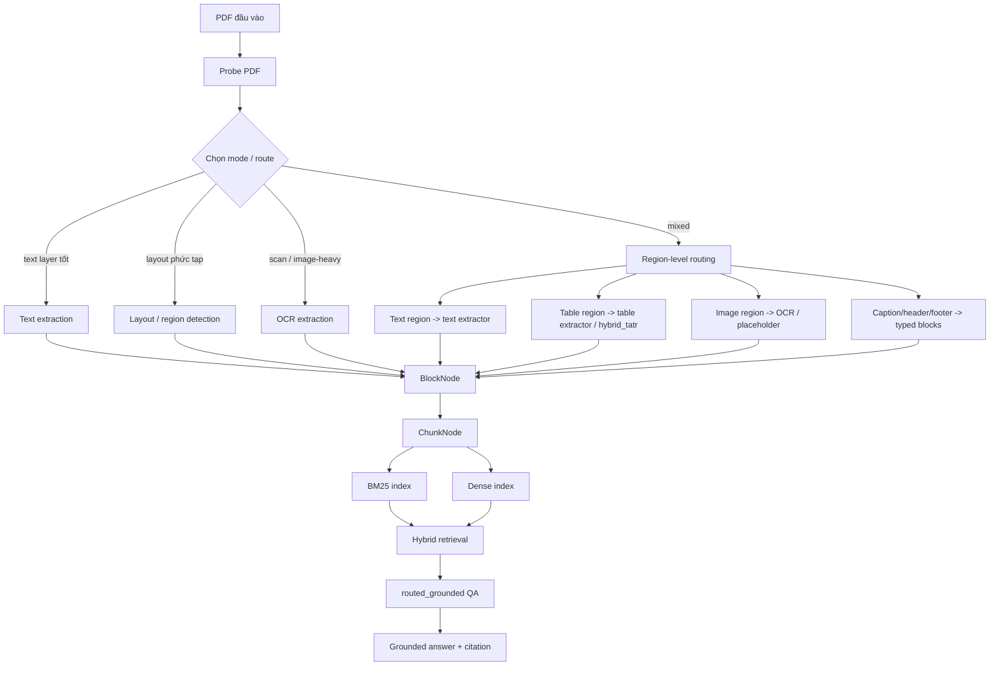

# Báo cáo tổng hợp chi tiết đồ án BOXTALK

Ngày cập nhật: 2026-05-19  
Đề tài: **Nghiên cứu các kĩ thuật truy xuất và hỏi đáp thông tin trên tài liệu PDF**  
Repo: **BOXTALK**  
Trạng thái hệ thống: research prototype có benchmark nhiều tầng, chưa claim SOTA, chưa claim production-ready.

---

## 1. Tóm tắt điều hành

Đồ án xây dựng một hệ thống hỏi đáp trên tài liệu PDF theo hướng **grounded QA có dẫn chứng**. Hệ thống không chỉ trả lời câu hỏi, mà còn cố gắng bảo đảm câu trả lời được sinh ra từ các đoạn bằng chứng đã truy xuất, có citation rõ ràng và hạn chế hallucination.

Pipeline chính hiện tại:

```text
PDF ingest
-> region-level routing / conditional hybrid_tatr table enhancement
-> chunk/index
-> retrieval
-> routed_grounded
-> grounded answer + citation
```

Các điểm đã hoàn thành:

- Có pipeline ingest PDF nhiều backend: text, layout, OCR, table, region-routed.
- Có region-level routing để phân vùng trang thành text/table/image/caption/header/footer rồi route sang extractor phù hợp.
- Có table extraction mặc định và nhánh **hybrid_tatr**: TATR geometry + OCR/PDF word boxes + deterministic text assignment.
- Có benchmark ingest: DocLayNet, PubLayNet, PubTables, PubTables structure, Bast-Korzen proxy, Nougat proxy, OCR/FUNSD/OCR-D.
- Có benchmark QA: benchmark nội bộ QCDT/Operations, SciFact, QASPER.
- Có retrieval benchmark riêng: hit@k, recall@k, MRR, NDCG.
- Có cải tiến OCR benchmark để không tính trùng auxiliary table cluster vào text OCR chính.
- Có validation gần nhất: `compileall` passed, `pytest` passed 60 tests, mock ingest success rate 1.000.

Kết luận ngắn:

> BOXTALK đủ tốt để chốt đồ án ở mức research prototype. Hệ thống mạnh ở ingest, table detection, grounded answer và citation. Điểm yếu còn lại nằm ở natural scientific QA trên paper dài như QASPER, exact HTML/CSV table reconstruction, OCR tiếng Việt thực tế và answer synthesis tự do.

---

## 2. Mục tiêu bài toán

PDF là định dạng khó xử lý vì nội dung trong PDF thường được lưu theo tọa độ hiển thị, không phải theo cấu trúc logic như paragraph, heading, table hay section. Với tài liệu scan, hệ thống còn phải OCR ảnh trước khi truy xuất.

Mục tiêu của đồ án:

1. Trích xuất nội dung từ PDF ở nhiều dạng: text PDF, layout phức tạp, bảng, hình, scan/OCR.
2. Chia nội dung thành chunk có metadata để index.
3. Truy xuất bằng BM25/dense/hybrid retrieval.
4. Chọn route xử lý câu hỏi bằng `routed_grounded`.
5. Trả lời ngắn gọn, có dẫn chứng, hạn chế hallucination.
6. Đánh giá hệ thống bằng nhiều tầng benchmark: ingest, retrieval, QA, citation.

---

## 3. Kiến trúc tổng thể



Vai trò từng tầng:

| Tầng | Vai trò | File/module chính |
|---|---|---|
| Probe | Đánh giá PDF thiên về text, scan, layout, mixed | `app/ingest/probe.py` |
| Text extraction | Lấy text layer bằng PyMuPDF, block text | `app/ingest/extract/text.py` |
| Layout extraction | Phát hiện vùng layout, bảng, hình, caption | `app/ingest/extract/model_layout.py`, `app/ingest/region/` |
| OCR | Render trang/region thành ảnh rồi OCR | `app/ingest/extract/ocr.py` |
| Table extraction | Trích xuất bảng, cell, CSV/HTML đơn giản | `app/ingest/extract/table.py` |
| TATR backend | Dùng Table Transformer cho detection/structure | `app/ingest/tatr_table_backend.py` |
| Hybrid table | TATR geometry + word boxes + text assignment | `app/ingest/extract/hybrid_tatr_table.py` |
| Chunking | Gom BlockNode thành ChunkNode | `app/ingest/chunker.py` |
| Retrieval | BM25, dense, hybrid, rerank | `app/retrieval/` |
| QA | Routed RAG, evidence checker, citation grounding | `app/qa/` |
| Evaluation | Metric ingest, retrieval, QA | `app/eval/`, `scripts/benchmark_*.py` |

---

## 4. Pipeline ingest chi tiết

### 4.1 Probe PDF

`app/ingest/probe.py` đọc một số trang đầu để ước lượng:

- `pages_with_text`: số trang có text layer.
- `pages_without_text`: số trang không có text layer.
- `text_layer_ratio`: tỷ lệ trang có text layer.
- `empty_text_ratio`: tỷ lệ trang trích text rỗng/yếu.
- `likely_scanned_ratio`: tỷ lệ trang có dấu hiệu scan.
- `image_heavy_ratio`: tỷ lệ trang nặng ảnh.
- `avg_text_quality`: điểm chất lượng text.
- `probe_detected_mode`: mode dự đoán: `text`, `layout`, `ocr`, `mixed`.

Ý nghĩa:

- Nếu PDF có text layer tốt: ưu tiên text extraction.
- Nếu gần như scan: ưu tiên OCR.
- Nếu vừa có text vừa nhiều ảnh/scan: dùng mixed/region-level routing.
- Nếu layout nhiều block: dùng layout-aware extraction.

### 4.2 Region-level routing

Region-level routing là cải tiến kiến trúc quan trọng:

```text
Page
-> detect regions: text / table / image / caption / header / footer
-> sort theo reading order
-> text region dùng text extractor
-> table region dùng table extractor / hybrid_tatr
-> image region dùng OCR/caption extractor nếu cần
-> gom lại thành BlockNode
```

Lợi ích:

- Nếu một PDF chủ yếu là text nhưng có một bảng, bảng không bị xử lý như paragraph thường.
- Nếu một trang có cả text và ảnh, hệ thống có thể route từng vùng thay vì chọn một backend cho toàn trang.
- Table region có thể đi thẳng sang table extractor.
- Kiến trúc rõ hơn, dễ giải thích trong báo cáo.

Kết quả mock benchmark sau region routing:

| Metric | Result |
|---|---:|
| success_rate | 1.000 |
| char_accuracy | 1.000 |
| token_f1 | 1.000 |
| reading_order_score | 1.000 |
| table_structure F1 | 1.000 |
| table_exact_csv | 1.000 |

Lưu ý: mock benchmark chỉ là smoke test synthetic, không phải benchmark khoa học lớn. Giá trị chính của region-level routing là kiến trúc và giảm rủi ro mixed PDF.

---

## 5. Xử lý bảng

### 5.1 Vấn đề

Bảng trong PDF khó vì:

- Text trong bảng thường bị lưu như các text span rời rạc.
- PDF không lưu sẵn row/column/cell logic.
- Bảng scan cần OCR trước.
- Header nhiều dòng, merged cell, footnote, caption dễ làm sai cấu trúc.

### 5.2 Backend mặc định

Backend mặc định dùng heuristic:

- Lấy text boxes/PDF words/OCR lines.
- Group theo row/column.
- Dựng cell từ vị trí.
- Xuất table cells, CSV/HTML đơn giản.

Ưu điểm:

- Nhanh.
- Không cần model nặng.
- Có text sẵn từ OCR/PDF.

Nhược điểm:

- Row/column grouping yếu với bảng phức tạp.
- Merged cell chưa hoàn chỉnh.
- Exact HTML/CSV thấp.

### 5.3 TATR

TATR dùng pretrained Microsoft Table Transformer:

- `microsoft/table-transformer-detection`
- `microsoft/table-transformer-structure-recognition-v1.1-all`

TATR mạnh ở geometry:

- table bbox
- row bands
- column bands
- spanning cell candidates

Nhưng TATR là image-only geometry model, không tự hiểu text trong cell. Vì vậy, nếu chỉ dùng TATR thuần, `table_structure F1` theo text rất thấp.

### 5.4 Hybrid TATR

Hybrid TATR kết hợp:

```text
TATR table/row/column geometry
+ OCR/PDF word boxes
+ deterministic word-to-cell assignment
-> structured table cells
-> CSV/HTML reconstruction
```

Word box là một bounding box gắn với một từ hoặc cụm từ:

```json
{
  "text": "Revenue",
  "bbox": [x0, y0, x1, y1],
  "confidence": 0.98,
  "source": "ocr|pdf_text|pubtables_words"
}
```

Tác dụng:

- TATR xác định hình học bảng.
- Word boxes cung cấp nội dung text.
- Hệ thống gán từng word vào cell dựa trên center-in-cell hoặc max overlap.
- Text trong cell được sắp theo reading order.

### 5.5 So sánh default, TATR và hybrid_tatr

Kết quả PubTables structure 25 mẫu:

| Backend | Det F1@0.50 | Cell F1@0.50 | Structure F1 | Text assign F1 | Row MAE | Col MAE | GriTS-con-like | Exact CSV |
|---|---:|---:|---:|---:|---:|---:|---:|---:|
| Default | 0.967 | 0.659 | 0.202 | 0.963 | 2.040 | 0.840 | 0.147 | 0.000 |
| TATR | 0.987 | 0.491 | 0.010 | 0.015 | 0.600 | 0.000 | 0.006 | 0.000 |
| hybrid_tatr OCR words | 0.987 | 0.598 | 0.638 | 0.955 | 0.600 | 0.000 | 0.387 | 0.040 |

Diễn giải:

- TATR thuần cải thiện detection và row/column count nhưng thiếu text assignment.
- Default có text tốt nhưng row/column yếu.
- Hybrid TATR kết hợp được geometry tốt của TATR với text boxes nên structure F1 tăng rõ.

### 5.6 PubTables structure proxy 500

Kết quả mở rộng với proxy word boxes từ PubTables annotation:

| Metric | Result |
|---|---:|
| samples | 500 |
| success_rate | 1.000 |
| table detection F1@0.50 | 0.984 |
| table detection F1@0.75 | 0.982 |
| table structure F1 | 0.749 |
| cell F1@0.50 | 0.930 |
| cell F1@0.75 | 0.901 |
| text assignment F1 | 0.997 |
| exact CSV | 0.480 |
| exact HTML | 0.000 |
| GriTS-top-like | 0.911 |
| GriTS-loc-like | 0.690 |
| GriTS-con-like | 0.689 |
| row_count_mae | 0.758 |
| col_count_mae | 0.136 |

Lưu ý quan trọng:

> PubTables structure proxy 500 dùng word boxes proxy từ annotation PubTables, không phải OCR thật. Có thể dùng để đánh giá reconstruction và text assignment khi word boxes tốt, nhưng không nên claim là hiệu năng OCR production.

---

## 6. OCR và scan PDF

### 6.1 Backend OCR

OCR hiện dùng PaddleOCR trong môi trường tách riêng:

- `.venv-gpu`: PyTorch/Transformers/layout/TATR.
- `.venv-ocr-gpu`: PaddleOCR GPU.

Lý do tách môi trường:

- Trên Windows, PaddleOCR/PaddlePaddle GPU và PyTorch CUDA có thể xung đột DLL/cuDNN nếu import trong cùng process.
- Tách OCR benchmark sang `.venv-ocr-gpu` giúp ổn định.

### 6.2 OCR pipeline

```text
PDF scan/image page
-> render page/region thành ảnh
-> optional preprocessing
-> PaddleOCR
-> normalize OCR result
-> sort OCR lines theo reading order
-> BlockNode
-> chunk/index
```

### 6.3 Cải tiến OCR mới nhất

Trước đó, OCR extractor có tạo `synthetic_table_cluster` để phục vụ bảng. Block này được dựng lại từ các OCR line đã có. Nếu benchmark text nối cả OCR line gốc và synthetic table block thì text bị tính trùng.

Cải tiến:

- Không tính `synthetic_table_cluster` vào primary OCR text.
- Vẫn giữ block này trong table payload để không mất thông tin bảng.
- Không hardcode theo benchmark/sample.
- Không dùng ground truth để sửa output.
- Không train model.

### 6.4 Kết quả OCR sau cải tiến

| Benchmark | Samples | OCR token F1 | Historical token F1 | CER | WER | Success |
|---|---:|---:|---:|---:|---:|---:|
| OCR-D PAGE-XML | 19 | 0.725 | 0.749 | 0.602 | 0.636 | 1.000 |
| FUNSD OCR | 25 | 0.826 | 0.827 | 0.466 | 0.515 | 1.000 |
| Synthetic OCR scan | 25 | 1.000 | 1.000 | 0.000 | 0.000 | 1.000 |

Before/after OCR-D:

| Metric | Previous checkpoint | Branch baseline | After fix |
|---|---:|---:|---:|
| OCR-D token F1 | 0.657 | 0.702 | 0.725 |
| OCR-D historical token F1 | 0.689 | 0.731 | 0.749 |

Diễn giải:

- OCR-D đã vượt ngưỡng 0.7 token F1.
- CER vẫn cao vì OCR-D là tài liệu lịch sử German/Latin/Fraktur-like, có nhiều ký tự cổ hoặc mã hóa lạ.
- Token F1 phù hợp hơn CER/WER trong benchmark này.

Hạn chế OCR:

- Chưa có benchmark OCR tiếng Việt thật.
- Chưa so sánh PaddleOCR với Tesseract `vie+eng` và EasyOCR `vi,en`.
- Preprocessing `auto` thử trên OCR-D làm giảm metric, nên chưa bật mặc định.

---

## 7. Chunking, index và retrieval

### 7.1 Chunking

`app/ingest/chunker.py` gom các `BlockNode` thành `ChunkNode`:

- Heading có thể mở chunk mới.
- Table block được giữ thành chunk riêng với `meta={"is_table_chunk": True}`.
- Chunk lưu page range, block ids, block types, source mode.

Mục tiêu:

- Giữ citation rõ ràng.
- Giữ bảng không bị trộn mất cấu trúc với paragraph.
- Cho retrieval truy ngược về block/page/source.

### 7.2 Retrieval

Các hướng retrieval đã benchmark:

- BM25 lexical retrieval.
- Dense retrieval với SentenceTransformer/MinILM.
- Hybrid retrieval.
- Hybrid rerank.

Dense model thường dùng:

- `sentence-transformers/all-MiniLM-L6-v2`

Metrics retrieval:

- Hit@k
- Recall@k
- MRR@k
- NDCG@k
- latency

### 7.3 SciFact retrieval

Kết quả SciFact retrieval-only:

| Metric | Result |
|---|---:|
| hybrid hit@5 | 0.793 |
| hybrid recall@5 | 0.771 |
| hybrid MRR@5 | 0.654 |
| hybrid NDCG@5 | 0.675 |

### 7.4 QASPER retrieval 500

Kết quả QASPER retrieval-only với `hybrid_rerank`, top-k=20:

| Metric | Result |
|---|---:|
| query_count | 500 |
| hit@20 | 0.392 |
| recall@20 | 0.344 |
| MRR@20 | 0.200 |
| NDCG@20 | 0.617 |
| avg latency | 74.6 ms |

Diễn giải:

- QASPER khó hơn vì mỗi paper dài, nhiều section, evidence có thể nằm rải rác.
- Top-k/rerank giúp retrieval nhưng chưa giải quyết answer correctness.
- Hướng phát triển nên là section-aware retrieval, query decomposition và answer synthesis tốt hơn.

---

## 8. QA pipeline

### 8.1 `routed_grounded`

`routed_grounded` là QA path chính:

```text
question
-> route planner
-> retrieval config
-> retrieve evidence
-> evidence sufficiency check
-> answer generation
-> citation grounding
-> final answer
```

Các nguyên tắc:

- Không trả lời nếu thiếu bằng chứng đủ mạnh.
- Câu trả lời phải bám vào retrieved evidence.
- Citation phải gắn với chunk/page/block đã truy xuất.
- LLM fallback/explanation không phải lõi chính.

### 8.2 LLM được bật khi nào?

Trong pipeline chính hiện tại:

- LLM thật không phải lõi chính.
- `routed_grounded` dùng rule/heuristic/evidence-grounded generation là đường chính.
- LLM fallback/explanation chỉ là experimental, dùng để phân tích hướng mở rộng.
- Các benchmark chính không claim LLM là core model.

Khi nào có thể bật LLM:

- Khi cần giải thích tự nhiên hơn.
- Khi answer synthesis/free-form QA quá khó với rule-based generation.
- Khi vẫn giữ evidence/citation checker để kiểm soát hallucination.

Không nên claim:

- LLM là lõi chính của hệ thống.
- LLM đảm bảo đúng nếu không có evidence.

---

## 9. Mô hình và công nghệ sử dụng

| Nhóm | Công nghệ/mô hình | Vai trò |
|---|---|---|
| PDF parsing | PyMuPDF/Fitz | Đọc text layer, render trang, lấy bbox |
| OCR | PaddleOCR | OCR cho scan/image PDF |
| Layout | model layout wrapper / DocLayNet-PubLayNet style labels | Detect vùng layout |
| Table detection | Microsoft Table Transformer detection | Phát hiện bảng |
| Table structure | Microsoft Table Transformer structure v1.1 all | Row/column/spanning geometry |
| Dense retrieval | `sentence-transformers/all-MiniLM-L6-v2` | Embedding chunks/questions |
| Lexical retrieval | BM25 | Keyword retrieval |
| Hybrid retrieval | Weighted BM25 + dense | Kết hợp lexical và semantic |
| QA | `routed_grounded` | Grounded answer + citation |
| Eval | custom ingest/QA metrics | F1, IoU, CER, WER, evidence, hallucination |

Các model TATR:

- `microsoft/table-transformer-detection`
- `microsoft/table-transformer-structure-recognition-v1.1-all`

---

## 10. Benchmark ingest

### 10.1 Layout/text/table/OCR results

| Benchmark | Samples | Backend | Metric chính | Result |
|---|---:|---|---|---:|
| DocLayNet | 49 | model_layout_direct | layout F1@0.50 | 0.849 |
| DocLayNet | 49 | model_layout_direct | layout F1@0.75 | 0.807 |
| PubLayNet | 100 | model_layout_direct | layout F1@0.50 | 0.739 |
| PubLayNet | 100 | model_layout_direct | layout F1@0.75 | 0.708 |
| PubTables detection | 500 | model_layout_direct | table det F1@0.50 | 0.975 |
| PubTables detection | 500 | model_layout_direct | table det F1@0.75 | 0.914 |
| PubTables structure OCR words | 25 | hybrid_tatr | table structure F1 | 0.638 |
| PubTables structure proxy words | 500 | hybrid_tatr | table structure F1 | 0.749 |
| Bast-Korzen proxy | 2 | text_direct | token F1 | 0.998 |
| Nougat/arXiv proxy | 25 | text_direct | token F1 | 0.628 |
| OCR scan synthetic | 25 | OCR | OCR token F1 | 1.000 |
| OCR-D PAGE-XML | 19 | OCR | OCR token F1 | 0.725 |
| FUNSD OCR | 25 | OCR | OCR token F1 | 0.826 |

### 10.2 PubTables detection mở rộng 500

| Run | Samples | F1@0.50 |
|---|---:|---:|
| checkpoint | 25 | 0.987 |
| large run | 100 | 0.960 |
| expanded run | 500 | 0.975 |

Diễn giải:

- Table detection ổn định trên 500 mẫu.
- Metric 500 thấp hơn checkpoint 25 một chút nhưng vẫn mạnh.
- 100-sample run thấp hơn 500 do phân bố mẫu khác nhau.

### 10.3 PubTables structure proxy 500

| Run | Samples | Structure F1 | Cell F1@0.50 | Exact CSV | GriTS-con-like |
|---|---:|---:|---:|---:|---:|
| OCR-word checkpoint | 25 | 0.638 | 0.598 | 0.040 | 0.387 |
| proxy run | 100 | 0.778 | 0.947 | 0.530 | 0.707 |
| proxy run | 500 | 0.749 | 0.930 | 0.480 | 0.689 |

Diễn giải:

- Khi có word boxes tốt, hybrid_tatr reconstruct bảng khá tốt.
- Exact HTML vẫn 0 vì HTML yêu cầu trùng cây/markup/merged cell rất nghiêm ngặt.
- Exact CSV đạt 0.480 ở proxy 500, cho thấy hướng reconstruction có giá trị.

---

## 11. QA benchmark nội bộ

### 11.1 QA smoke

| Metric | Result |
|---|---:|
| query_count | 5 |
| answer_match_rate | 1.000 |
| evidence_match_rate | 1.000 |
| grounded_rate | 1.000 |
| hallucination_rate | 0.000 |
| end_to_end_success_rate | 1.000 |
| table_question_success | 1.000 |

### 11.2 QCDT real PDF

| Metric | Result |
|---|---:|
| query_count | 40 |
| answer_match_rate | 0.725 |
| evidence_match_rate | 1.000 |
| grounded_rate | 1.000 |
| hallucination_rate | 0.000 |
| end_to_end_success_rate | 0.725 |
| table_question_success | 1.000 |

Diễn giải:

- QCDT là benchmark nội bộ, không uy tín bằng benchmark khoa học lớn.
- Điểm `answer_match_rate = 0.725` nghĩa là hệ thống đúng phần lớn nhưng chưa hoàn hảo.
- `hallucination_rate = 0.000` cho thấy câu trả lời vẫn được kiểm soát bằng evidence/citation.

### 11.3 Operations benchmark

| Metric | Result |
|---|---:|
| query_count | 40 |
| answer_match_rate | 0.925 |
| evidence_match_rate | 1.000 |
| grounded_rate | 1.000 |
| hallucination_rate | 0.000 |
| end_to_end_success_rate | 0.925 |
| table_question_success | 1.000 |

---

## 12. SciFact benchmark

SciFact là benchmark claim-evidence/citation khoa học, không phải natural QA thuần. Nó phù hợp để đánh giá:

- claim verification style question
- evidence retrieval
- citation correctness
- groundedness

Kết quả SciFact QA:

| Metric | Result |
|---|---:|
| query_count | 300 |
| answer_match_rate | 0.220 |
| evidence_match_rate | 0.727 |
| grounded_rate | 1.000 |
| hallucination_rate | 0.000 |
| end_to_end_success_rate | 0.203 |
| avg answer token F1 | 0.271 |

Kết quả retrieval-only:

| Metric | Result |
|---|---:|
| hybrid hit@5 | 0.793 |
| hybrid recall@5 | 0.771 |
| hybrid MRR@5 | 0.654 |
| hybrid NDCG@5 | 0.675 |

Diễn giải:

- Evidence/citation tương đối tốt.
- Answer match thấp vì SciFact là claim-evidence benchmark, gold answer không giống natural QA.
- Grounded rate 1.000 và hallucination 0.000 là điểm mạnh chính.

---

## 13. QASPER benchmark

QASPER là natural scientific QA benchmark trên paper khoa học. Nó khó hơn SciFact vì:

- Câu hỏi tự nhiên hơn.
- Paper dài hơn.
- Câu trả lời free-form.
- Evidence có thể nằm rải rác ở nhiều section.
- Có câu unanswerable.

### 13.1 QASPER 100 checkpoint

| Metric | Result |
|---|---:|
| papers | 82 |
| chunks | 3,630 |
| questions | 100 |
| answerable | 95 |
| unanswerable | 5 |
| evidence mapped to chunks | 90 |
| answer_match_rate | 0.100 |
| evidence_match_rate | 0.360 |
| grounded_rate | 1.000 |
| hallucination_rate | 0.050 |
| end_to_end_success_rate | 0.020 |

Retrieval-only checkpoint:

| Setting | Hit | Recall |
|---|---:|---:|
| top_k=5 hybrid_rerank | 0.400 | 0.336 |
| top_k=10 hybrid_rerank | 0.520 | 0.451 |
| top_k=20 hybrid_rerank | 0.580 | 0.530 |

### 13.2 QASPER 500 expanded

| Metric | Result |
|---|---:|
| papers | 234 |
| chunks | 11,086 |
| questions | 500 |
| answerable | 470 |
| unanswerable | 30 |
| evidence mapped to chunks | 455 |
| answer_match_rate | 0.082 |
| answerable_answer_match_rate | 0.081 |
| evidence_match_rate | 0.240 |
| grounded_rate | 1.000 |
| hallucination_rate | 0.054 |
| end_to_end_success_rate | 0.048 |
| abstain_accuracy | 0.100 |
| avg answer token F1 | 0.060 |

QASPER 500 retrieval-only:

| Metric | Result |
|---|---:|
| strategy | hybrid_rerank |
| top_k | 20 |
| hit@20 | 0.392 |
| recall@20 | 0.344 |
| MRR@20 | 0.200 |
| NDCG@20 | 0.617 |
| avg latency | 74.6 ms |

Diễn giải:

- QASPER 500 xác nhận đây là benchmark khó nhất.
- Tăng top-k/rerank giúp retrieval ở subset 100, nhưng trên 500 query retrieval vẫn còn yếu.
- `grounded_rate = 1.000` cho thấy hệ thống vẫn bám evidence khi trả lời.
- `answer_match_rate = 0.082` cho thấy answer synthesis/free-form QA chưa đủ mạnh.
- `hallucination_rate = 0.054` thấp nhưng không bằng 0; cần cải thiện abstention và evidence sufficiency.

---

## 14. Validation hiện tại

Validation gần nhất trên nhánh OCR:

```text
python -m compileall app scripts  -> passed
pytest -q                         -> 60 passed
mock ingest benchmark             -> success_rate 1.000
```

Mock ingest recheck:

| Metric | Result |
|---|---:|
| success_rate | 1.000 |
| char_accuracy | 1.000 |
| token_f1 | 1.000 |
| OCR token F1 | 1.000 |
| table_structure F1 | 1.000 |
| table_exact_csv | 1.000 |

---

## 15. Các cải tiến chính trong quá trình làm đồ án

### 15.1 Ingest benchmark framework

Đã bổ sung:

- Unified benchmark adapter.
- Mock/sample mode.
- Support local subset.
- `summary.json`, `per_sample.jsonl`, `README.md`.
- Metrics cho text, layout, table, OCR.

### 15.2 Region-level routing

Từ pipeline chọn backend toàn tài liệu, nâng lên xử lý từng vùng:

```text
text region -> text extractor
table region -> table extractor / hybrid_tatr
image region -> OCR/caption extractor
```

Giá trị:

- Đúng hơn về kiến trúc.
- Hợp với PDF mixed.
- Dễ mở rộng cho caption/figure/table-aware retrieval.

### 15.3 Table structure bằng hybrid_tatr

Từ TATR geometry-only:

```text
TATR -> rows/columns nhưng không có text
```

Nâng thành:

```text
TATR geometry + word boxes + text assignment
```

Kết quả:

- Structure F1 từ 0.010 của TATR thuần lên 0.638 trên OCR-word 25.
- Proxy 500 đạt structure F1 0.749.

### 15.4 OCR quality filtering

Đã tránh tính trùng auxiliary OCR table cluster trong primary OCR text.

Kết quả:

- OCR-D token F1 sau fix: 0.725.
- FUNSD token F1 sau fix: 0.826.

### 15.5 Scientific QA benchmark

Đã bổ sung:

- SciFact: claim-evidence benchmark.
- QASPER: natural scientific QA.
- Retrieval-only probes với top-k/rerank.

---

## 16. Phân tích điểm mạnh

Điểm mạnh của hệ thống:

1. Pipeline end-to-end rõ ràng từ PDF ingest đến grounded answer.
2. Có nhiều backend ingest phù hợp nhiều loại PDF.
3. Có region-level routing, phù hợp PDF mixed.
4. Table detection mạnh trên PubTables 500: F1@0.50 = 0.975.
5. Hybrid TATR cải thiện table structure khi có word boxes.
6. QA nội bộ QCDT/Operations giữ hallucination 0.000.
7. SciFact có evidence match 0.727 và hallucination 0.000.
8. Có benchmark minh bạch nhiều tầng, không chỉ demo.
9. Có tài liệu kết quả và lệnh reproduce.
10. Không overclaim LLM; pipeline chính vẫn grounded.

---

## 17. Hạn chế

Các hạn chế cần viết thẳng trong đồ án:

1. **QASPER thấp**: answer_match_rate 0.082 trên 500 query, cho thấy natural scientific QA vẫn khó.
2. **Answer synthesis còn yếu**: hệ thống tốt ở groundedness nhưng chưa mạnh ở free-form answer.
3. **Abstention chưa tốt**: QASPER abstain_accuracy 0.100.
4. **Exact HTML table chưa giải quyết**: exact HTML vẫn 0.
5. **PubTables proxy 500 không phải OCR production**: word boxes đến từ annotation/proxy.
6. **OCR tiếng Việt thật chưa có benchmark riêng**.
7. **DocLayNet/PubLayNet local subset chưa đủ 500 mẫu**.
8. **LLM fallback chỉ là experimental**, chưa phải pipeline chính.
9. **Gold answer nội bộ không uy tín bằng benchmark công khai** như SciFact/QASPER.
10. **Không claim SOTA** vì chưa train/fine-tune và chưa chạy full official leaderboard.

---

## 18. Safe claims và do-not-claim

### Safe claims

- Hệ thống triển khai được pipeline PDF QA có citation.
- Hệ thống có benchmark nhiều tầng: ingest, retrieval, table, OCR, QA.
- Table detection mạnh trên PubTables subset 500.
- Hybrid TATR + word boxes cải thiện table structure so với TATR geometry-only.
- OCR-D token F1 đã vượt 0.7 sau khi loại trùng auxiliary text.
- SciFact cho thấy hệ thống có khả năng evidence/citation trên benchmark khoa học.
- QASPER chỉ ra hạn chế thật của natural scientific QA trên paper dài.
- Grounded rate cao trong các benchmark chính.

### Do not claim

- Không claim SOTA.
- Không claim xử lý hoàn hảo mọi PDF.
- Không claim table extraction hoàn chỉnh.
- Không claim exact HTML/CSV đã giải quyết xong.
- Không claim hybrid_tatr production-ready cho mọi tài liệu.
- Không claim LLM là lõi chính của hệ thống.
- Không claim PubTables proxy 500 tương đương OCR production.

---

## 19. Lệnh reproduce chính

### Ingest/layout/table

```powershell
.\.venv-gpu\Scripts\python.exe scripts\benchmark_ingest_suite.py --dataset doclaynet --data-dir data\benchmarks\doclaynet --limit 0 --out results\ingest\doclaynet_49_large_20260517 --mode layout --device cuda

.\.venv-gpu\Scripts\python.exe scripts\benchmark_ingest_suite.py --dataset publaynet --data-dir data\benchmarks\publaynet --limit 0 --out results\ingest\publaynet_100_large_20260517 --mode layout --device cuda

.\.venv-gpu\Scripts\python.exe scripts\benchmark_ingest_suite.py --dataset pubtables --data-dir data\benchmarks\pubtables_detection --limit 500 --out results\ingest\pubtables_detection_500_large_20260517 --mode table --device cuda
```

### PubTables structure

```powershell
.\.venv-gpu\Scripts\python.exe scripts\prepare_pubtables_structure_subset.py --limit 500 --out data\benchmarks\pubtables_structure_500_proxy_20260517

.\.venv-gpu\Scripts\python.exe scripts\benchmark_ingest_suite.py --dataset pubtables_structure --data-dir data\benchmarks\pubtables_structure_500_proxy_20260517 --limit 0 --out results\ingest\pubtables_structure_500_proxy_hybrid_tatr_large_20260517 --mode table --table-backend hybrid_tatr --device cuda --save-predictions
```

### OCR

```powershell
.\.venv-ocr-gpu\Scripts\python.exe scripts\benchmark_ingest_suite.py --dataset ocr --data-dir data\benchmarks\ocrd_pagexml\ocr --limit 19 --out results\ingest\ocrd_pagexml_19_ocr_improve_after_aux_filter_20260517 --mode ocr --save-predictions

.\.venv-ocr-gpu\Scripts\python.exe scripts\benchmark_ingest_suite.py --dataset ocr --data-dir data\benchmarks\funsd\ocr --limit 25 --out results\ingest\funsd_ocr_25_ocr_improve_after_aux_filter_20260517 --mode ocr --save-predictions

.\.venv-ocr-gpu\Scripts\python.exe scripts\benchmark_ingest_suite.py --dataset ocr --data-dir data\benchmarks\ocr_scan_25\ocr --limit 25 --out results\ingest\ocr_scan_25_ocr_improve_after_aux_filter_20260517 --mode ocr --save-predictions
```

### SciFact

```powershell
.\.venv-gpu\Scripts\python.exe scripts\benchmark_qa.py --index-dir results\retrieval_index\scifact_qa_minilm_20260513 --queries data\benchmarks\scifact_qa\queries_test.jsonl --output-dir results\qa_benchmark\scifact_qa_minilm_large_20260517 --config routed_grounded --no-warmup
```

### QASPER 500

```powershell
.\.venv-gpu\Scripts\python.exe scripts\prepare_qasper_qa_benchmark.py --output-dir data\benchmarks\qasper_qa_500_20260517 --split validation --limit 500 --seed 42

.\.venv-gpu\Scripts\python.exe scripts\build_retrieval_index.py --chunks-jsonl data\benchmarks\qasper_qa_500_20260517\qasper.jsonl --output-dir results\retrieval_index\qasper_qa_500_minilm_20260517 --dense-preset minilm --dense-device cuda

.\.venv-gpu\Scripts\python.exe scripts\benchmark_qa.py --index-dir results\retrieval_index\qasper_qa_500_minilm_20260517 --queries data\benchmarks\qasper_qa_500_20260517\queries.jsonl --output-dir results\qa_benchmark\qasper_qa_500_minilm_20260517 --config routed_grounded --no-warmup

.\.venv-gpu\Scripts\python.exe scripts\benchmark_retrieval.py --index-dir results\retrieval_index\qasper_qa_500_minilm_20260517 --queries data\benchmarks\qasper_qa_500_20260517\queries.jsonl --output-dir results\retrieval_benchmark\qasper_qa_500_hybrid_rerank_top20_20260517 --strategy hybrid_rerank --top-k 20 --candidate-k 50 --rerank-top-n 20 --reranker heuristic --no-warmup
```

### Validation

```powershell
.\.venv-gpu\Scripts\python.exe -m compileall app scripts
.\.venv-gpu\Scripts\python.exe -m pytest -q
.\.venv-gpu\Scripts\python.exe scripts\benchmark_ingest_suite.py --dataset mock --limit 5 --out results\ingest\mock_ocr_improve_recheck_20260517 --mode all
```

---

## 20. Kết luận cuối cùng

Đồ án đã xây dựng được một hệ thống hỏi đáp PDF có dẫn chứng theo hướng grounded RAG. Hệ thống không chỉ dừng ở demo, mà đã có framework đánh giá nhiều tầng từ ingest PDF đến retrieval, table extraction, OCR và QA end-to-end.

Kết quả thực nghiệm cho thấy:

- Ingest PDF và table detection hoạt động ổn định trên nhiều benchmark.
- Table structure được cải thiện rõ nhờ hybrid_tatr khi có word boxes.
- OCR benchmark yếu nhất đã vượt ngưỡng 0.7 token F1.
- QA nội bộ đạt kết quả tốt và không phát hiện hallucination.
- SciFact chứng minh khả năng evidence/citation trên benchmark khoa học.
- QASPER chỉ ra giới hạn thật của hệ thống với natural scientific QA trên paper dài.

Kết luận nên đưa vào báo cáo:

> BOXTALK là một research prototype hoàn chỉnh cho bài toán truy xuất và hỏi đáp trên tài liệu PDF. Hệ thống có pipeline ingest nhiều backend, region-level routing, retrieval lai, routed grounded QA và cơ chế citation để kiểm soát hallucination. Các benchmark cho thấy hệ thống hoạt động tốt ở ingest, table detection, OCR subset và grounded QA nội bộ; đồng thời benchmark QASPER chỉ ra các thách thức còn lại về natural scientific QA, answer synthesis và abstention.

Hướng phát triển ưu tiên:

1. Section-aware retrieval cho paper dài.
2. Answer synthesis tốt hơn cho free-form QA.
3. Abstention handling cho câu không đủ bằng chứng.
4. OCR tiếng Việt thật với benchmark riêng.
5. Official GriTS metric cho table structure.
6. Table-aware retrieval từ structured table cells.
7. LLM fallback có kiểm soát bằng evidence/citation checker.

