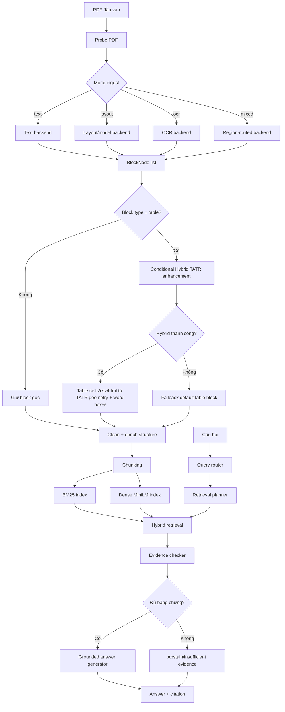

# Báo cáo pipeline chính sau khi tích hợp Hybrid TATR 2026-05-14

## 1. Mục tiêu

Tài liệu này mô tả lại toàn bộ pipeline BOXTALK sau khi đưa `hybrid_tatr` vào luồng ingest chính theo cơ chế an toàn. Nội dung gồm:

- sơ đồ kiến trúc chi tiết;
- các mô hình và kỹ thuật sử dụng;
- luồng xử lý từ PDF đến câu trả lời;
- cách `hybrid_tatr` được gọi trong pipeline chính;
- benchmark trước/sau;
- giới hạn và cách diễn giải trong đồ án.

Phạm vi đúng:

- QA chính vẫn là `routed_grounded`.
- LLM thật không bật làm lõi pipeline chính.
- `hybrid_tatr` được đưa vào pipeline chính như module tăng cường bảng có điều kiện, không thay toàn bộ ingest backend.
- Nếu `hybrid_tatr` thiếu model, thiếu word boxes hoặc lỗi runtime, pipeline fallback về bảng mặc định.

## 2. Kiến trúc tổng thể



## 3. File chính trong pipeline

| Thành phần | File | Vai trò |
|---|---|---|
| Entry ingest | `app/ingest/pipeline.py` | Hàm `ingest_pdf`, chọn backend, normalize, clean, enrich, chunk |
| Probe PDF | `app/ingest/probe.py` | Tính text/image/scan/quality ratios và quyết định mode |
| Text extraction | `app/ingest/extract/text.py` | Trích xuất PDF text layer bằng PyMuPDF |
| OCR extraction | `app/ingest/extract/ocr.py` | OCR cho scan/image region |
| Region routing | `app/ingest/extract/region_routed.py` | Tách vùng text/image và route từng vùng |
| Model layout | `app/ingest/extract/model_layout.py` | Detect layout region như text/table/figure/caption |
| Table default | `app/ingest/extract/table.py` | Dựng bảng mặc định từ PDF/OCR words |
| Hybrid TATR region | `app/ingest/extract/hybrid_tatr_table.py` | Tăng cường bảng bằng TATR geometry + word boxes |
| TATR backend | `app/ingest/tatr_table_backend.py` | Load Table Transformer và dựng rows/columns/cells |
| Retrieval index | `scripts/build_retrieval_index.py` | Build BM25 + dense index |
| QA benchmark | `scripts/benchmark_qa.py` | Đánh giá routed QA |

## 4. Hybrid TATR được gọi khi nào?

Sau cập nhật này, `hybrid_tatr` là một bước trong pipeline ingest chính:

```text
ingest_pdf()
-> chạy extractor theo mode
-> normalize pages/blocks
-> _enhance_table_blocks_with_hybrid_tatr()
-> clean_blocks()
-> enrich_structure()
-> build_chunks()
```

Điều kiện gọi:

- block có `block_type == "table"`;
- block có `bbox`;
- block chưa được xử lý bởi `hybrid_tatr`;
- `hybrid_tatr` không bị tắt bằng env;
- có PDF/OCR word boxes hoặc cho phép geometry-only;
- model TATR đã có trong Hugging Face cache, hoặc người dùng bật rõ để cho phép load/download.

Nếu không đủ điều kiện:

- pipeline giữ nguyên block bảng mặc định;
- metadata có thể ghi `hybrid_tatr_pipeline_skipped`;
- ingest không fail.

## 5. Cơ chế an toàn khi đưa vào pipeline chính

Thiết kế mới dùng chế độ `auto`:

| Trường hợp | Hành vi |
|---|---|
| Không có bảng | Không gọi TATR |
| Có bảng nhưng không có word boxes | Fallback default table |
| Có bảng nhưng chưa có TATR model cache | Fallback default table |
| Có bảng và TATR chạy thành công | Thay table block bằng table cells/csv/html tốt hơn |
| TATR lỗi runtime | Giữ block bảng cũ và ghi metadata lỗi |
| Muốn ép chạy TATR | Đặt `BOXBIIBOO_TABLE_BACKEND=hybrid_tatr` |
| Muốn tắt TATR | Đặt `BOXBIIBOO_TABLE_BACKEND=default` hoặc `BOXBIIBOO_ENABLE_PIPELINE_HYBRID_TATR_TABLES=0` |

Lệnh bật ép hybrid:

```powershell
$env:BOXBIIBOO_TABLE_BACKEND="hybrid_tatr"
```

Lệnh tắt:

```powershell
$env:BOXBIIBOO_TABLE_BACKEND="default"
```

## 6. Các mô hình/kỹ thuật sử dụng

| Tầng | Mô hình/kỹ thuật | Trạng thái |
|---|---|---|
| Text extraction | PyMuPDF text blocks | Chính |
| Layout detection | DocLayNet-compatible object detection | Chính khi bật layout/model |
| OCR | PaddleOCR GPU | Chính cho scan/OCR |
| Table default | Word clustering + deterministic grid reconstruction | Chính/fallback |
| TATR detection | `microsoft/table-transformer-detection` | Thành phần của hybrid |
| TATR structure | `microsoft/table-transformer-structure-recognition-v1.1-all` | Thành phần của hybrid |
| Hybrid table | TATR rows/cols/spans + OCR/PDF word assignment | Chính có điều kiện |
| Sparse retrieval | BM25 | Chính |
| Dense retrieval | MiniLM `sentence-transformers/all-MiniLM-L6-v2` | Chính |
| Rerank | Heuristic reranker | Chính/benchmark |
| QA | `routed_grounded` + evidence checker + grounded answer generator | Chính |
| LLM fallback | OpenAI-compatible/Ollama/dummy | Thực nghiệm, không bật chính |

## 7. Benchmark ingest trước/sau

| Benchmark | Metric | Before | After | Ghi chú |
|---|---|---:|---:|---|
| Bast-Korzen proxy | token F1 | - | 0.998 | Text extraction tốt |
| DocLayNet 25 | layout F1@0.50 | 0.815 | 0.879 | Layout cải thiện |
| PubLayNet 25 | layout F1@0.50 | 0.771 | 0.778 | Scientific layout tăng nhẹ |
| PubTables detection 25 | table det F1@0.50 | - | 0.987 | Table detection mạnh |
| OCR scan 25 | OCR token F1 | - | 1.000 | Subset scan chạy ổn |
| Nougat/arXiv proxy 25 | token F1 | - | 0.628 | Academic proxy còn khó |

## 8. Benchmark table structure trước/sau

### 8.1. Theo từng mốc cải tiến

| Mốc | Det F1@0.50 | Cell F1@0.50 | Structure F1 | Text assign F1 | Ghi chú |
|---|---:|---:|---:|---:|---|
| OCR table structure ban đầu | 0.900 | 0.435 | 0.208 | - | Baseline OCR cluster nhỏ |
| Structure post-processing | 0.967 | 0.668 | 0.169 | 0.963 | Cell bbox/text assignment tốt hơn |
| Row/column fix | 0.967 | 0.659 | 0.202 | 0.963 | Row MAE giảm 2.240 -> 2.040 |
| hybrid_tatr OCR words | 0.987 | 0.598 | 0.638 | 0.955 | Structure tăng mạnh nhờ TATR geometry + OCR words |

### 8.2. So sánh backend bảng

| Backend | Det F1@0.50 | Cell F1@0.50 | Cell F1@0.75 | Structure F1 | Text assign F1 | Row MAE | Col MAE | GriTS-con-like | Exact CSV |
|---|---:|---:|---:|---:|---:|---:|---:|---:|---:|
| Default | 0.967 | 0.659 | 0.184 | 0.202 | 0.963 | 2.040 | 0.840 | 0.147 | 0.000 |
| TATR | 0.987 | 0.491 | 0.103 | 0.010 | 0.015 | 0.600 | 0.000 | 0.006 | 0.000 |
| hybrid_tatr OCR words | 0.987 | 0.598 | 0.248 | 0.638 | 0.955 | 0.600 | 0.000 | 0.387 | 0.040 |

Kết luận:

- Default vẫn là fallback ổn định.
- TATR geometry-only không đủ vì không có text.
- Hybrid TATR tốt hơn rõ về structure F1 và GriTS-con-like.
- Exact CSV vẫn thấp vì yêu cầu trùng tuyệt đối row/col/text/merged cell/markup.

## 9. Benchmark QA end-to-end trước/sau

| Benchmark | Before answer match | After answer match | Delta | Before E2E | After E2E | Before hallucination | After hallucination |
|---|---:|---:|---:|---:|---:|---:|---:|
| QA smoke routed | 1.000 | 1.000 | +0.000 | 1.000 | 1.000 | 0.000 | 0.000 |
| QCDT routed same index | 0.725 | 0.725 | +0.000 | 0.725 | 0.725 | 0.000 | 0.000 |
| QCDT older baseline index | 0.675 | 0.725 | +0.050 | 0.675 | 0.725 | 0.000 | 0.000 |
| Operations routed | 0.925 | 0.925 | +0.000 | 0.925 | 0.925 | 0.025 | 0.000 |
| SciFact public QA/citation | - | 0.220 | - | - | 0.203 | - | 0.000 |
| QASPER natural scientific QA | - | 0.100 | - | - | 0.020 | - | 0.050 |

Diễn giải:

- QA chính vẫn là `routed_grounded`.
- Hybrid TATR nằm ở ingest/table, không thay đổi bản chất QA path.
- Không ghi nhận hallucination trên QA smoke, QCDT, Operations, SciFact.
- QASPER thấp vì natural scientific QA khó hơn và cần answer synthesis/abstention tốt hơn.

## 10. SciFact

SciFact là benchmark claim-evidence/citation khoa học.

| Metric | Kết quả |
|---|---:|
| query_count | 300 |
| answer_match_rate | 0.220 |
| evidence_match_rate | 0.727 |
| grounded_rate | 1.000 |
| hallucination_rate | 0.000 |
| end_to_end_success_rate | 0.203 |
| hybrid hit@5 | 0.793 |
| hybrid recall@5 | 0.771 |
| hybrid MRR@5 | 0.654 |
| hybrid NDCG@5 | 0.675 |

## 11. QASPER

QASPER là benchmark natural scientific QA.

| Field | Value |
|---|---:|
| papers | 82 |
| chunks | 3,630 |
| questions | 100 |
| answerable | 95 |
| unanswerable | 5 |
| evidence mapped to chunks | 90 |

QA:

| Metric | Kết quả |
|---|---:|
| answer_match_rate | 0.100 |
| evidence_match_rate | 0.360 |
| grounded_rate | 1.000 |
| hallucination_rate | 0.050 |
| end_to_end_success_rate | 0.020 |
| abstain_accuracy | 0.000 |

Retrieval-only:

| Run | Hybrid rerank Hit | Hybrid rerank Recall |
|---|---:|---:|
| top_k=5 | 0.400 | 0.336 |
| top_k=10 | 0.520 | 0.451 |
| top_k=20 | 0.580 | 0.530 |

Kết luận QASPER:

- Tăng top-k/rerank cải thiện evidence recall.
- Answer correctness không tăng tương ứng.
- Nút thắt chính là free-form answer synthesis và abstention.

## 12. Validation sau khi tích hợp Hybrid TATR vào pipeline chính

Đã chạy:

```powershell
.\.venv-gpu\Scripts\python.exe -m compileall app scripts
.\.venv-gpu\Scripts\python.exe -m pytest -q
.\.venv-gpu\Scripts\python.exe scripts\benchmark_ingest_suite.py --dataset mock --limit 5 --out results\ingest\mock_after_main_hybrid_tatr_final --mode all
```

Kết quả:

- compileall pass;
- pytest: 56 passed;
- mock ingest success_rate = 1.000;
- mock ingest error_count = 0;
- nếu TATR model không có cache, pipeline vẫn fallback default, không fail.

## 13. Safe claims sau cập nhật

Có thể nói:

- Pipeline chính đã có bước tăng cường bảng bằng Hybrid TATR có điều kiện.
- Hybrid TATR chỉ chạy với block/vùng bảng và có fallback.
- QA chính vẫn là `routed_grounded`, không bật LLM thật.
- Hybrid TATR cải thiện table structure trên PubTables structure subset.
- Hệ thống vẫn kiểm soát hallucination tốt trên benchmark chính.

Không nên nói:

- Không claim Hybrid TATR xử lý hoàn hảo mọi bảng.
- Không claim exact CSV/HTML đã giải quyết xong.
- Không claim SOTA.
- Không claim LLM là lõi chính.
- Không claim mọi PDF đều được xử lý hoàn hảo.

## 14. Kết luận

Sau cập nhật này, `hybrid_tatr` không còn chỉ là benchmark backend đứng ngoài pipeline. Nó đã được nối vào `ingest_pdf()` như một bước tăng cường có điều kiện cho table block. Thiết kế này giữ được độ ổn định của default ingest vì luôn fallback khi thiếu điều kiện, đồng thời cho phép hệ thống tận dụng TATR geometry khi có model và word boxes phù hợp. Đây là cách tích hợp hợp lý cho đồ án: vừa đưa cải tiến bảng vào pipeline chính, vừa không overclaim và không làm QA/retrieval phụ thuộc bắt buộc vào model nặng.
